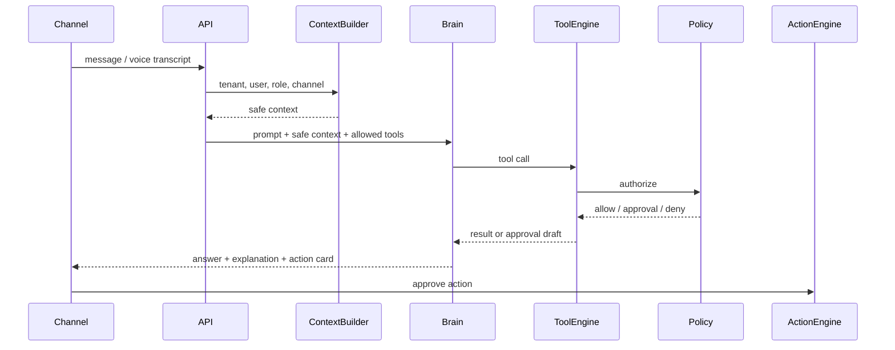

# AI

## Цель

Описать AI architecture Maya OS: agents, brain, planner, tools, memory, knowledge,
prompt registry, approval gates, evaluation and explainability.

## Описание

AI в Maya OS не является автономным доступом к данным. AI - это reasoning layer,
который получает безопасный контекст, выбирает backend tools, объясняет
результаты и предлагает действия. Все факты, деньги, записи, права и аудит
обрабатываются backend.

## Agent Model

| Agent | Пользователь | Основная функция |
|---|---|---|
| Maya Brain | все | intent, routing, tool choice, final answer |
| Maya OS | owner | управление компанией через диалог |
| Maya Admin | admin/staff | календарь, запись, расписание, ответы |
| Maya Consult | client | консультации, запись, продажи packages |
| Maya Finance | owner/solo | P&L, расходы, прибыль, прогноз |
| Maya Analytics | owner/admin | KPI, BI, причины изменений |
| Maya Marketing | owner/admin | сегменты, кампании, retention |
| Maya Reception | client/phone | входящие обращения и запись |
| Maya HR | owner | сотрудники, загрузка, качество, tasks |
| Maya Assistant | owner | личные операционные задачи |

Agents are logical roles over the same core. They are not separate LLMs by
default. Separation is controlled by prompts, tools, memory scopes and policies.

## AI Request Flow

## Maya Brain

Responsibilities:

- classify intent;
- determine role and mode;
- select agent persona;
- call tools;
- request clarification when needed;
- explain recommendations;
- produce action draft;
- never invent business facts.

Non-responsibilities:

- direct database queries;
- direct CRM calls;
- raw PII handling;
- final execution of high-risk actions;
- arithmetic that backend can compute.

## Memory Engine

Memory scopes:

- User preference memory: safe preferences, no raw PII.
- Customer service memory: style, habits, last service notes through safe IDs.
- Staff memory: working preferences, tasks, training state.
- Business memory: rules, pricing policy, tone, procedures.
- Tenant memory: brand, vertical, vocabulary, operating rules.

Memory must have source, timestamp, confidence, scope, retention and deletion
policy.

## Knowledge Engine

Knowledge sources:

- tenant policies;
- service catalog;
- staff handbook;
- vertical playbooks;
- legal/consent templates;
- product docs;
- adapter capability docs.

RAG output must include source IDs. If no source supports an answer, Maya must
say that it does not know or ask to add knowledge.

## Tool Registry

Each tool definition includes:

- name;
- description;
- schema;
- tenant scope;
- allowed roles;
- risk tier;
- required consent;
- idempotency behavior;
- approval requirement;
- audit fields;
- timeout and retry policy;
- fallback behavior.

The first production-shaped implementation lives in
`maya-saas-backend/src/ai-tools`: `POST /api/ai/chat` is the common model
adapter/orchestrator and `/api/ai/tools/*` is the deterministic execution and
approval boundary. Channels do not hold provider keys or duplicate prompts.

## Сценарии Использования

### Owner action card

1. Owner asks: "где теряем деньги".
2. Brain calls `get_risk_signals` and `get_money_opportunities`.
3. Backend returns facts and estimated impact.
4. Brain explains why action matters.
5. Brain creates `salon_action` draft.
6. Owner approves.
7. Action Engine validates and runs the job.
8. Analytics records outcome for ROI.

### Staff client context

1. Staff asks about upcoming client.
2. Brain only sees staff-allowed tools.
3. Tool Engine validates staff access to appointment/customer.
4. Memory Engine returns safe preferences and service history.
5. Maya gives concise work recommendation without raw phone/email.

### Client support

1. Client asks to reschedule.
2. Brain calls own appointment tools.
3. Tool Engine verifies customer ownership.
4. Maya offers available alternatives.
5. Client confirms.
6. Backend reschedules through CRM adapter and audits the action.

## Action Engine

Action Engine executes only validated actions. AI can draft but not bypass:

- campaigns;
- appointment changes;
- payments/refunds;
- payroll;
- price changes;
- tenant settings;
- data export.

## Prompt Registry

Prompts must be versioned by:

- agent;
- role;
- channel;
- tenant;
- language;
- vertical;
- model/provider;
- effective date.

Prompt changes require evals for booking, privacy, tool use and role isolation.

## Explainability

Every recommendation should answer:

1. What happened?
2. Why does Maya think so?
3. Which facts/tools support it?
4. What action is proposed?
5. What risk or uncertainty exists?
6. What happens if the user approves?

## Requirements

- AI receives only tools allowed for actor role.
- Tool results are minimized to what the model needs.
- PII redaction happens before LLM boundary.
- Tool execution is deterministic and audited.
- High-risk tools return approval request instead of executing.
- Models can be changed without changing business contracts.

## Constraints

- Some models require different APIs; adapter layer must hide this from product.
- Voice needs shorter, more conversational responses.
- Staff and client modes must not leak tools into each other.
- External AI pricing changes; billing data must be configurable.

## Risks

- Prompt injection through user messages.
- Hallucinated facts if model answers without tools.
- Over-broad owner tools exposed to manager/admin.
- Inconsistent prompt versions across channels.
- Unbounded cost from voice or long tool loops.

## Recommendations

1. Extend the typed platform Tool Registry deliberately; persist executions and
   approvals, not model-controlled tool definitions or conversation text.
2. Add AI evals for every risky workflow.
3. Use deterministic Python/NestJS for analytics and actions.
4. Keep "agent" as logical routing until scale demands separate workers.
