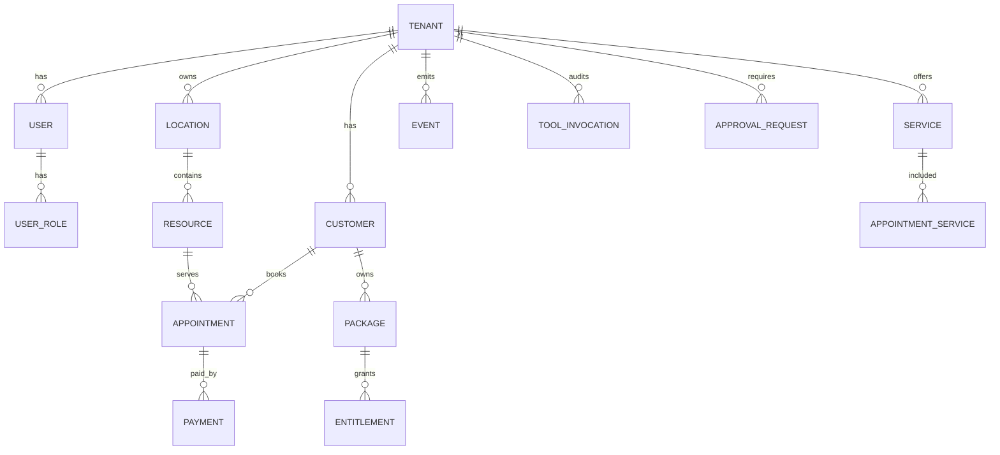

# Data Model

## Цель

Определить универсальную модель данных Maya OS, не привязанную к beauty.

## Описание

Модель строится вокруг сервисного бизнеса: компания продает услуги, планирует
ресурсы, обслуживает клиентов, принимает платежи, ведет коммуникации и
управляет знаниями. Вертикальные особенности должны выражаться через metadata,
taxonomies, feature flags и adapter mappings, а не отдельные hardcoded таблицы.

## Core Entities

## Entity Notes

- `Customer` is tenant-scoped. Same human in two tenants is two customer records.
- `User` is platform identity. It may link to a customer record and staff profile.
- `UserRole` is multi-valued: owner + staff + client is valid.
- `Resource` covers staff, room, equipment, chair, court, car lift or online slot.
- `Service` has duration, price rules, required resources and vertical metadata.
- `Appointment` is a booking shell; details live in appointment services and events.
- `Event` is immutable and powers analytics, automation and audit.

## Analytics Model

Operational tables are not enough for Maya OS. Required materialized layer:

- `metrics_daily`;
- `kpi_tenant_daily`;
- `kpi_staff_daily`;
- `kpi_service_daily`;
- `customer_cadence`;
- `segment_snapshot`;
- `campaign_outcome`;
- `forecast_log`;
- `director_recommendation`;
- `tool_cost_daily`.

## Requirements

- Every tenant-owned object has `tenant_id`.
- Money values store currency and minor units.
- Time values store timezone-aware timestamps plus local business date where needed.
- External IDs are namespaced by adapter/provider.
- Soft-delete or event-sourcing is preferred for business-critical objects.

## Constraints

- CRM source of truth may not expose all data consistently.
- Some CRMs use global numeric IDs that collide across tenants.
- Analytics cannot rely on live CRM calls at response time.

## Risks

- Building KPI on live CRM APIs will be slow and flaky.
- Mixing platform user and tenant customer will break multi-role users.
- Storing PII in AI memory will violate privacy constraints.

## Recommendations

1. Use events as the bridge between CRM sync and AI analytics.
2. Keep memory records separate from PII records.
3. Backfill at least 90 days before launching causal KPI.
4. Design mapping tables for each CRM adapter from the beginning.
