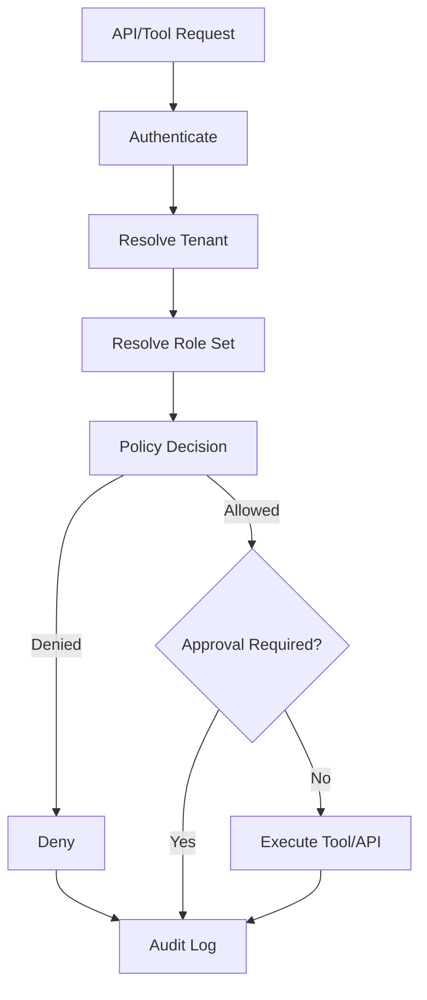

# Security And Permissions

## Цель

Зафиксировать security-first модель Maya OS: tenant isolation, role permissions,
PII handling, approvals, audit, secrets и безопасный AI tool calling.

## Описание

Maya OS обрабатывает ПД, расписания, финансы, зарплаты, платежи, коммуникации и
AI-действия. Поэтому security layer является продуктовым фундаментом, а не
последующим hardening.

## Permission Model

Access decision = tenant + authenticated actor + role set + resource ownership +
tool risk tier + feature/plan gate + consent state.

## Roles And Capabilities

| Capability | Client | Staff | Admin | Owner |
|---|---:|---:|---:|---:|
| Own profile/history | yes | if own client profile | yes, limited | yes |
| Own appointments | yes | yes | yes | yes |
| All appointments | no | limited by policy | yes | yes |
| Client phone | own only | no/default no | limited | yes |
| Revenue analytics | no | own/team limited | operational | full |
| Payroll | no | own only | no/default no | full |
| Marketing campaigns | no | no | prepare/preview | approve/send |
| Billing/plan | no | no | no | full |
| Tenant settings | no | no | limited | full |
| Dangerous writes | own only | limited | approval/policy | approval |

## Tool Risk Tiers

| Tier | Examples | Behavior |
|---|---|---|
| Read | services, slots, own history, KPI summary | direct execution after auth |
| Low write | save preference, draft task | execution + audit |
| Medium write | create/reschedule appointment, send single message | confirmation or policy gate |
| High write | mass campaign, cancel many records, change prices, payroll, payments | human approval mandatory |
| Restricted | raw PII export, secret access, bypass consent | never available to LLM |

## Data Protection

- Raw phone/name/email/payment IDs never enter LLM prompts.
- Phone lookup uses deterministic hash/HMAC.
- Encrypted PII at rest with managed rotation procedure.
- Voice/photo/biometric data require explicit consent and region-safe processing.
- Cross-border AI processing requires separate legal decision and technical gate.
- Logs redact tokens, PII and request bodies that can contain secrets.

## Approval Requirements

Every ApprovalRequest must include:

- tenant_id;
- actor_user_id;
- requested_by AI/tool/user;
- action_type;
- risk_tier;
- human-readable explanation;
- exact payload preview;
- expiry time;
- audit hash;
- result: approved, rejected, expired, superseded.

## Requirements

- No endpoint trusts role from frontend or LLM input.
- No tool can access another tenant by argument injection.
- Every write tool has idempotency key.
- Every campaign checks consent before audience expansion.
- Every external adapter call is scoped to tenant credentials.
- Production secrets live in env/secret store, not repo.

## Constraints

- Existing production still has security remediation work. New platform work must
  not copy old patterns with secrets in code or global CRM credentials.
- PII encryption key rotation requires data migration; never rotate blindly.

## Risks

- AI prompt injection through customer messages.
- IDOR through record_id/staff_id/client_id if resource ownership is skipped.
- Cross-tenant leakage through analytics cache.
- Wrong role resolution for multi-role users.
- Mass messaging without consent.

## Recommendations

1. Create a central Policy Decision Point used by API and Tool Engine.
2. Add automated tests for each role/tool pair.
3. Add tenant isolation tests to every new repository/module.
4. Keep AI-generated action payloads as drafts until backend validates them.
5. Treat security remediation as Wave 0 before SaaS launch.
