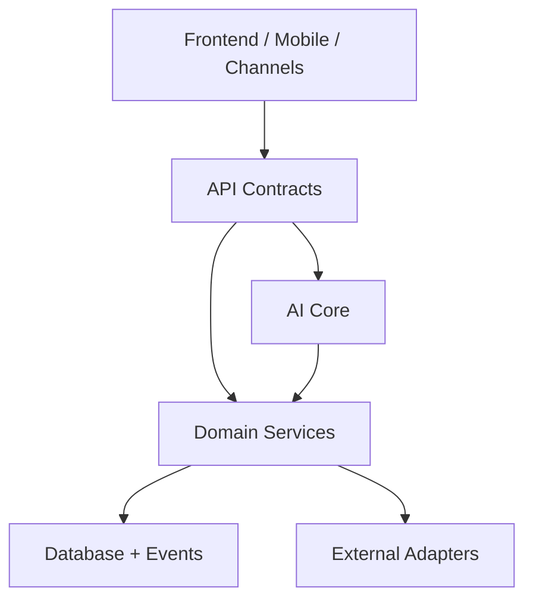

# Engineering

## Цель

Описать инженерные правила разработки Maya OS: API-first, testing, deployment,
observability, data quality, migration from current production and operational
standards.

## Описание

Maya OS должна развиваться 10 лет. Поэтому инженерная стратегия: стабильное
platform core, adapters for volatile vendors, strong tests around permissions,
and phased migration from the current production vertical.

## Engineering Principles

- API contracts before UI.
- Backend owns business logic.
- Frontend renders state and submits intents.
- Deterministic code computes facts.
- LLM explains and plans, not executes hidden side effects.
- Tests scale with risk.
- Production changes are small, reversible and observable.

## System Boundaries

## API Requirements

Every API endpoint must define:

- authentication;
- tenant resolution;
- role requirements;
- request schema;
- response schema;
- errors;
- idempotency;
- audit behavior;
- rate limits;
- feature/plan gate.

## Testing Strategy

Minimum tests:

- unit tests for domain rules;
- permission matrix tests;
- tenant isolation tests;
- adapter contract tests;
- AI tool authorization tests;
- approval gate tests;
- idempotency tests for money/bookings/campaigns;
- frontend smoke tests for critical flows;
- migration dry-run tests.

## Сценарии Использования

### Adding a new tool

1. Define API/domain service contract.
2. Add tool schema and risk tier.
3. Add role/tenant policy.
4. Add approval behavior if needed.
5. Add unit and permission tests.
6. Add AI eval for prompt/tool behavior.
7. Expose to allowed roles only.

### Adding a new CRM adapter

1. Implement adapter contract.
2. Add mapping tests for services, staff, slots and appointments.
3. Run preview mode against sandbox/test tenant.
4. Validate idempotency and error handling.
5. Enable live mode only after owner/admin approval.

### Deploying platform backend

1. Deploy separate API domain.
2. Apply migrations.
3. Run health check.
4. Smoke-test auth, tenant, billing, CRM preview.
5. Switch frontend API base only after green checks.

## Observability

Track:

- tool invocation count, latency, error rate;
- model usage and cost by tenant/agent/channel;
- booking success/failure reasons;
- CRM adapter errors;
- notification delivery;
- approval conversion;
- campaign ROI;
- voice latency and disconnects;
- tenant billing status.

## Deployment Strategy

Current safe sequence:

1. Security remediation.
2. Freeze and verify current production state.
3. Keep current Python production stable.
4. Deploy NestJS backend as separate API.
5. Smoke-test auth, tenant, billing, CRM adapters.
6. Move non-critical tenant/admin flows first.
7. Migrate analytics/data platform.
8. Migrate booking writes only after preview/live gates are proven.

## Migration Rules

- Never break current salon while building platform.
- Keep rollback path for each migration.
- Sync before cutover; dual-write only where audited.
- Use read-only shadow mode before live writes.
- Compare counts and business metrics before switching source.

## Requirements

- No secrets in repo, logs or docs.
- `.env.example` contains names only, no values.
- CI blocks tenantless tables in platform modules.
- CI blocks tools without policy/risk metadata.
- Production deploys include health checks and rollback notes.
- Model pricing is verified before changing billing constants.

## Constraints

- Existing frontend PWA is bundled `app.html`.
- iOS mirrors PWA through Capacitor and requires sync after web changes.
- Existing production DB can be empty locally; production truth is remote/CRM.
- Some current code is monolithic; refactor must be incremental.

## Risks

- Accidental overwrite of working production bundle.
- Drifting PWA/iOS copies.
- Hidden secrets in old backups.
- Adapter divergence between CRM providers.
- Tests passing on empty local data but failing in production.

## Recommendations

1. Add a platform CI checklist before onboarding any external tenant.
2. Introduce a `tools/` or `core/` package for shared AI contracts.
3. Keep production vertical and platform backend connected through documented
   adapters, not copy-paste.
4. Build migration dashboards for data count and revenue reconciliation.
