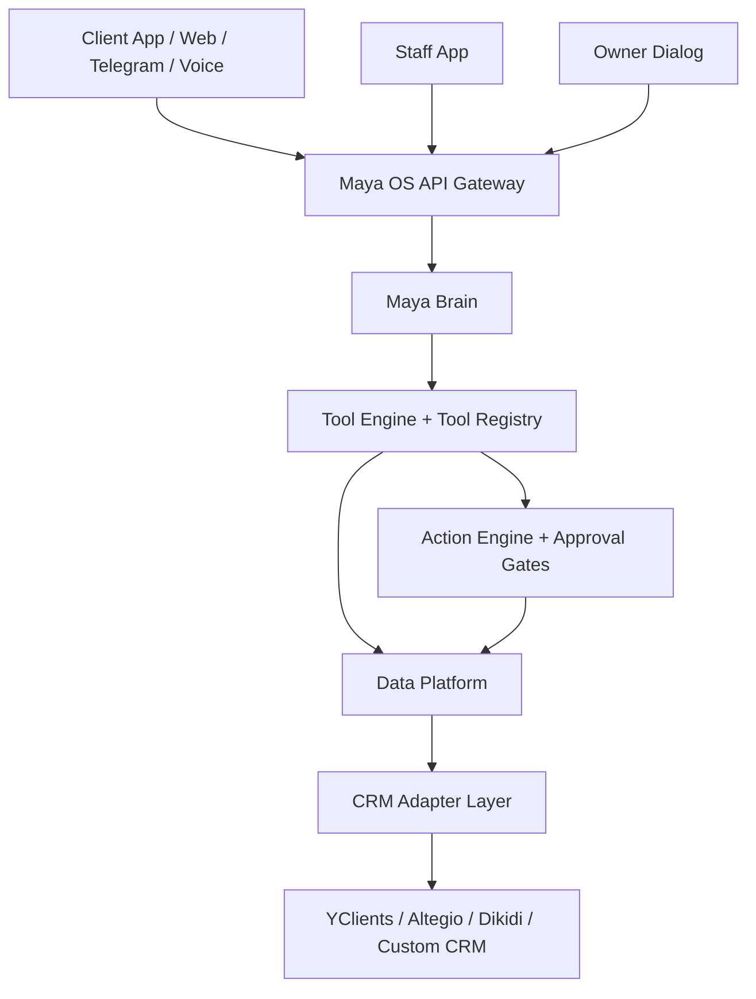

# Maya OS Documentation

Дата: 2026-07-08
Статус: базовая архитектурная спецификация v1.0
Область: универсальная AI Operating System для сервисного бизнеса

## Цель

Этот раздел фиксирует целевую архитектуру Maya OS так, чтобы команда могла
разрабатывать платформу без повторного изобретения базовых принципов. Maya OS
не проектируется как CRM, чат или приложение записи. Это AI-first операционная
система, через которую владелец, сотрудники и клиенты управляют сервисным
бизнесом.

Beauty и барбершоп "Мужская Эстетика" остаются первой вертикалью и боевым
полигоном. Все новые сущности и контракты должны быть универсальными для
fitness, wellness, clinic, dental, education, coaching, consulting, auto
service, rental, repair, pet services и других сервисных компаний.

## Структура

- [Product](product/README.md) - миссия, роли, сценарии, продуктовые границы.
- [Architecture](architecture/README.md) - компоненты ядра, multi-tenant модель,
  данные, безопасность, интеграции.
- [AI](AI/README.md) - агенты, память, tools, planner, approval gates, prompts.
- [Engineering](Engineering/README.md) - API-first правила разработки, качество,
  деплой, наблюдаемость.
- [Roadmap](Roadmap/README.md) - этапы реализации от текущего продукта до Maya OS.
- [ADR](ADR/README.md) - архитектурные решения.

## Текущая база проекта

Сегодня проект состоит из двух параллельных контуров:

- Production vertical: Python/aiohttp/SQLite/YClients/PWA/Telegram/iOS wrapper для
  "Мужской Эстетики".
- SaaS platform backend: NestJS/Prisma/PostgreSQL с tenant, branding, auth,
  billing, CRM adapters и admin API.

Целевая стратегия: считать production vertical первой вертикалью и источником
проверенных бизнес-сценариев, а платформенное ядро развивать как отдельную
multi-tenant систему с адаптерами к CRM и каналам.

## Архитектурные законы

1. AI работает только через backend tools, не напрямую с БД.
2. Любая бизнес-логика существует через API.
3. Multi-tenant и tenant isolation проектируются с первого дня.
4. White-label является системным свойством, а не темой UI.
5. Все опасные действия проходят через human approval.
6. LLM не считает деньги и KPI: факты считает deterministic backend.
7. ПД, фото, аудио и платежные данные не уходят в LLM.
8. Любая функция должна работать на мобильном сценарии.
9. Все роли и permissions решаются на сервере.
10. Новая вертикаль не должна требовать переписывания ядра.

## Верхнеуровневая схема

## Definition Of Done для этой документации

- Описаны продуктовая миссия и роли.
- Описаны ключевые компоненты Maya Core.
- Описаны AI agents, tool calling, memory и approvals.
- Описана универсальная модель данных.
- Описаны security, permissions и tenant isolation.
- Описана стратегия масштабирования и white-label.
- Описаны этапы реализации и ключевые риски.
- Зафиксированы ADR для базовых решений.
