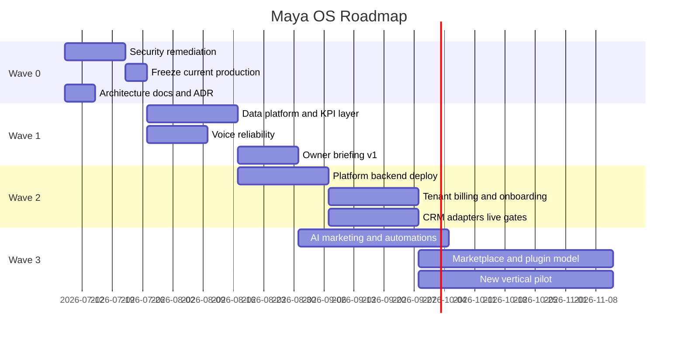

# Roadmap

## Цель

Определить путь от текущего продукта MAYA для одного салона к Maya OS как
универсальной AI Operating System для сервисного бизнеса.

## Описание

Roadmap строится не по "фичам ради фич", а по зависимостям. Сначала безопасность
и архитектурный фундамент, затем надежная AI-операционка для одного tenant,
затем platform/SaaS и новые вертикали.

## Волны Реализации

## Wave 0 - Foundation

Goals:

- rotate secrets and move runtime config to env/secret store;
- verify no secret backups remain in web roots;
- freeze current production state and tests;
- commit current clean baseline;
- finish Maya OS documentation and ADR;
- close biometric/photo legal gaps before scaling.

Exit criteria:

- secrets no longer live in code;
- current production passes smoke checks;
- dirty worktree is understood and committed or intentionally archived;
- architecture docs are accepted as reference.

## Wave 1 - Single-Tenant AI OS

Goals:

- data platform for metrics and events;
- causal KPI engine;
- robust owner briefing;
- stable push/voice contours;
- action cards with approval and audit;
- role and identity hardening.

Exit criteria:

- owner can ask "why" and get fact-backed answer;
- Maya can propose one safe action with expected impact;
- actions are audited and reversible where possible;
- voice/chat share core context and role rules.

## Wave 2 - Platform/SaaS

Goals:

- deploy NestJS/Postgres backend;
- enable tenant onboarding;
- activate billing and plan gates;
- connect real CRM adapters through preview/live modes;
- white-label config and logo upload in production;
- tenant isolation verification.

Exit criteria:

- second internal/demo tenant can run without touching first tenant;
- public onboarding creates isolated tenant;
- billing can move tenant through trial/active/past_due/suspended;
- CRM live writes require explicit readiness gate.

## Wave 3 - Revenue Automation

Goals:

- AI Marketing with consent-aware campaigns;
- RFM/churn segments;
- campaign ROI tracking;
- workflow builder;
- staff trainer;
- forecasts and alerts.

Exit criteria:

- Maya not only reports, but reliably earns or saves money;
- owner sees ROI per recommendation;
- campaign delivery respects consent and quiet hours;
- workflows have approvals and audit.

## Wave 4 - Marketplace And Multi-Vertical

Goals:

- plugin/marketplace model;
- MCP-compatible tools where useful;
- vertical templates;
- partner CRM adapters;
- voice/phone receptionist;
- first non-beauty pilot.

Exit criteria:

- new vertical uses same core entities;
- adapter certification checklist exists;
- marketplace items cannot bypass permissions;
- platform can sell beyond first vertical.

## Current Gaps

- Security remediation is not fully closed.
- Current production AI director is single-salon and read-mostly.
- Platform backend is local/not deployed.
- Data platform/ETL for causal KPI is not complete.
- Tool Registry and Prompt Registry are still mostly code-level.
- Human approval model exists in principle but needs centralization.
- Native iOS push via APNs is not implemented.
- Multi-tenant CRM credentials are not active in production.

## Сценарии Использования

### MVP acceptance

Owner opens Maya in the morning and receives a fact-backed briefing: bookings,
expected revenue, risks, empty capacity and one recommended next action with an
explanation and expected impact.

### SaaS pilot acceptance

A second tenant can register, configure branding, connect CRM in preview mode,
see its own services/staff/slots, run phone or OAuth auth, and remain fully
isolated from the first tenant.

### Multi-vertical acceptance

A non-beauty business can model its services, resources, customers and
appointments without new core tables. Only templates, taxonomy and adapter
mapping change.

## Requirements

- Do not onboard external tenants before Wave 0 and tenant isolation tests.
- Do not enable mass marketing before consent registry.
- Do not enable high-risk autonomous actions before approval/audit.
- Do not launch new vertical without domain model review.

## Recommendations

1. Next engineering sprint: close Wave 0 and freeze current production.
2. Next product sprint: owner briefing + causal KPI, not more UI panels.
3. Next platform sprint: deploy NestJS backend on separate API domain.
4. Next growth sprint: AI marketing only after consent and event tracking.
