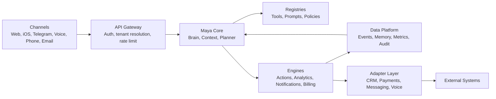
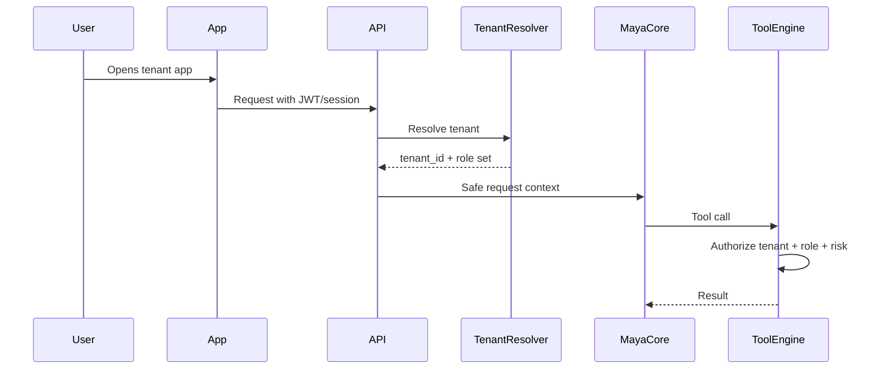
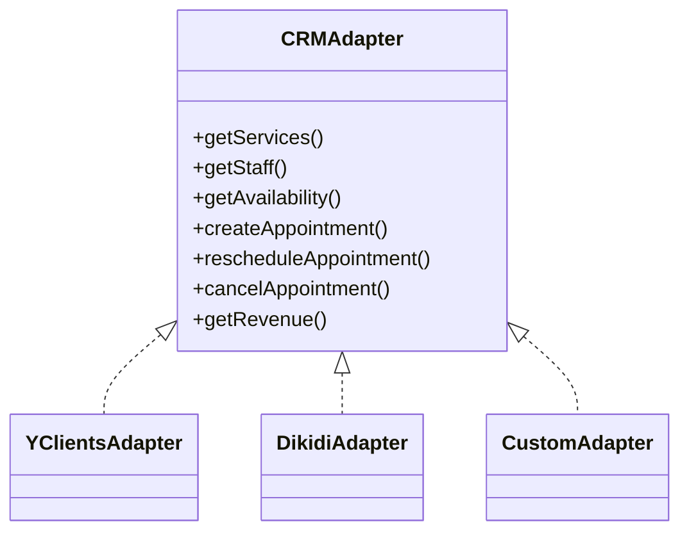

# Architecture

## Цель

Описать целевую архитектуру Maya OS: компоненты ядра, границы модулей,
multi-tenant модель, данные, security, integrations и путь от текущего проекта к
универсальной платформе.

## Описание

Maya OS строится как modular monolith first с ясными доменными границами и
готовностью к выделению сервисов после появления нагрузки. Главный риск сейчас
не в недостатке микросервисов, а в смешении AI, permissions, business logic,
frontend state и CRM-specific кода.

## Permanent principles: service business, tenant policy, conversation

Зафиксировано владельцем 2026-09-12. Этот раздел — единый нормативный источник
принципов для Chapters 7–10, Orchestrator и Agent System. Он расширяет уже
принятую универсальную архитектуру Maya OS; ссылки из product/rebuild docs не
создают параллельных спецификаций.

Это **архитектурные требования и target flows**, а не новая feature wave или
заявление, что все описанные connectors, policies и agents уже реализованы.
В этом documentation cycle runtime/schema/migrations/production не меняются.
Утверждённые Chapter 6 owners и Chapter 7 contracts сохраняются; их пересмотр
возможен только при конкретном доказанном contradiction. Исторические статусы
в обзорах ниже не заменяют актуальные package reports и production evidence.

### 1. Service-business core; barbershop is a reference vertical

Барбершоп — первый production/reference vertical, **не Maya Core domain**.
Базовый язык ядра: `Tenant`, `Client`, `Staff`, `Service`, `Appointment`,
`Attendance`, `Payment / Financial Fact`, `Expense`, `Communication`,
`Opportunity`, `Action`, `Outcome`, `Measurement`, `Consent`, `Review / Feedback`.
Это доменные concepts, не требование создать по таблице для каждого слова.

`barber`, `haircut`, `beard`, `chair`, услуги одного бизнеса, отраслевые KPI,
cadence посещений, loyalty thresholds и salary cycles допустимы только в явно
scoped vertical profile, tenant policy, presentation или skill/capability.
Названия первого tenant в UI/fixtures не делают его правила общими для ядра.

`BARBERSHOP-SPECIFIC BUSINESS RULE IN CORE → ARCHITECTURAL FAIL`.

### 2. CRM is a provider boundary

YClients — первый CRM provider/adapter, не доменная модель Maya:
`provider representation → provider adapter → Maya canonical domain`.
Provider IDs и vocabulary остаются в qualified integration/binding/evidence
контуре; они не подменяют canonical Client, tenant authority или business truth.
Адаптер обязан явно обозначать unsupported/unknown capabilities и неполноту
источника, а не достраивать универсальную семантику из особенностей YClients.

Новая CRM подключается через adapter и qualified source mapping, без переписывания
Client, Action Engine, Communication Delivery, Measurement, Opportunity,
Orchestrator или Agent System. Provider mutations остаются у approved executor;
наличие метода adapter не даёт AI/route/measurement права вызывать его напрямую.

`NEW CRM REQUIRES CORE BUSINESS LOGIC REWRITE → ARCHITECTURAL FAIL`.

### 3. Tenant policy and vertical/capability profiles

Иерархия: `Maya Core → Vertical Profile → Tenant Policies → Orchestrator / Agents`.
Core задаёт неизменяемые границы безопасности и canonical owners. Профиль
предлагает defaults/recommendations, tenant подтверждает собственные policies,
а Orchestrator/agents используют их в пределах доступных capabilities.
Tenant override не может обходить security, identity, role/branch authority,
consent/preferences, entitlements или execution policy. Owner approval не
заменяет Client consent; scoring/audience membership не являются consent.

Tenant configuration включает payroll period и payment cadence, financial/report
periods, начало/конец business week, report schedule, goals/KPI, permissions,
notification preferences, return cadence/dormancy thresholds, terminology,
approval thresholds и allowed autonomous actions. Например, Thursday→Wednesday
с weekly payment, 1st–15th / 16th–month-end или daily — **разные возможные policies**,
ни одна не является universal Maya rule. Policy одного tenant не переносится
другому по памяти модели или сходству отрасли.

**Vertical Profile / Capability Profile** — архитектурный concept: terminology,
applicable capabilities, typical KPI, service semantics, suggested policies,
opportunity types, valuation inputs, relevant agent skills и allowed workflows.
Tenant может отличаться от profile defaults. Профиль не выдаёт permissions,
consent или autonomy и не обещает unavailable connector. Само введение concept
не разрешает новую schema; отсутствующий persistence/action contract должен
быть mapped в соответствующей будущей главе до реализации.

`BUSINESS-SPECIFIC POLICY HARDCODED IN CORE → FAIL`.
`AI ASSUMES ONE TENANT'S HABITS APPLY TO ANOTHER → FAIL`.

### 4. Conversation proposes; the canonical owner persists

Conversation — primary onboarding/configuration interface. Большая форма
допустима как fallback, admin editor или advanced surface; она не обязательный
основной сценарий. Maya интерпретирует речь, собирает structured draft, находит
недостающие обязательные параметры, задаёт только нужные вопросы и показывает
owner точное резюме для explicit confirmation.

`conversation → structured draft → deterministic validation → owner confirmation
→ canonical configuration action → Tenant Policy`.

LLM может интерпретировать, объяснять и предлагать. Он не является system of
record, не сохраняет policy молча и не превращает conversation history или
memory в configuration authority. Подтверждение относится к показанному draft;
исполняющий owner повторно проверяет exact tenant/actor/scope и действующую
policy. Existing A22 configuration actions/revisions и отдельные personal
preferences сохраняют свои scopes; новый conversational initiator не создаёт
parallel configuration owner и не делает личные настройки общими для tenant.

`LLM MAY INTERPRET CONFIGURATION`.
`LLM MAY NOT SILENTLY AUTHOR BUSINESS POLICY`.
`CHAT HISTORY != CANONICAL CONFIGURATION`.

### 5. Secure connection is separate from conversation

Maya не просит прислать в чат CRM API token, password, private/signing key,
database credential, Telegram bot token или OAuth refresh token. Secure flow:
`chat: Connect CRM → separate secure credential input / OAuth → backend credential
storage → status/reference for Maya`, например `CRM_CONNECTED` / `credential_ref`.

Raw secrets не допускаются в LLM prompts, conversation history, ordinary logs,
business configuration или analytics. Credential storage отделён от business
configuration; reference не является секретом или доказательством доступа сам
по себе. Необходимую authority проверяет backend connector. Transport draft/
activation tokens существующего onboarding API не являются сообщениями LLM:
они остаются в защищённом protocol flow по своему контракту, не в chat history.
Redaction случайно присланного секрета не оправдывает required chat-secret flow.

`API TOKEN ENTERED INTO LLM CONVERSATION AS REQUIRED FLOW → ARCHITECTURAL FAIL`.
`LLM RECEIVES RAW PROVIDER CREDENTIALS → FAIL`.
`CHAT HISTORY USED AS SECRET STORE → FAIL`.
`CREDENTIAL STORAGE == BUSINESS CONFIG STORAGE → FAIL`.

### 6. External business sources are user-bound providers

Owner может дать ссылку на сайт, карточку Яндекса/2ГИС или иной public source.
Целевой flow: распознать source type → определить candidate Tenant/Branch и
внешнюю сущность → показать owner → подтвердить принадлежность → сохранить
canonical external-source binding через authorized owner → проверить реальные
capabilities connector. Сопоставление URL/названия создаёт candidate, не authority.
URL, slug или подтверждение владельца сами по себе не выдают provider credentials,
прав доступа или разрешения на сбор недоступных данных.

| Capability level (conceptual) | Что можно утверждать |
| --- | --- |
| `LINK_ONLY` | Источник привязан; автоматическое получение данных не доказано |
| `PUBLIC_OBSERVATION` | Connector действительно поддерживает получение разрешённых публичных показателей в указанном scope |
| `OFFICIAL_API` | Поддерживается официальная integration; доступ, scope и фактические data capabilities проверяются отдельно |

Это архитектурные уровни, **не новые schema enum values и не реестр уже работающих
интеграций**. `LINK != VERIFIED DATA ACCESS`. При отсутствии connector Maya говорит:
«Источник привязан, но автоматическое получение отзывов сейчас недоступно».
Provider-specific scraping не предполагается как core capability.

`EXTERNAL URL == AUTOMATIC MONITORING → FAIL`.
`PROVIDER-SPECIFIC SCRAPING ASSUMED AS CORE CAPABILITY → FAIL`.
`REPUTATION AGENT HARD-CODED TO YANDEX/2GIS → FAIL`.

### Target onboarding and reports

Target registration развивает [существующий conversational onboarding](../product/ai-onboarding.md),
не утверждая готовность всех последующих шагов:

1. Owner рассказывает Maya о бизнесе обычным языком.
2. Maya определяет candidate business type/profile, branches, timezone и provider.
3. Owner подключает CRM через отдельный secure input/OAuth.
4. Adapter передаёт staff, services, branches, schedule, Clients, Appointments и
   доступные financial facts существующим canonical import/source owners.
5. Maya спрашивает только недостающее: расчёты с командой, отчёты и расписание,
   KPI, допустимую автономию и обязательные confirmations. Без сотрудников
   payroll-вопросы не задаются; неизвестные факты не подменяются догадкой.
6. Maya показывает структурированное «Вот как я поняла ваш бизнес».
7. Owner явно подтверждает настройки.
8. Canonical configuration owner сохраняет Tenant Policies. Optional external
   sources привязываются через отдельный подтверждённый binding flow.

CRM import не означает автоматический grant consent/permissions и не заменяет
verified Client binding. Новые capabilities становятся доступными только после
проверки readiness/authority. Цель — подключить новый service business и дать
Orchestrator/agents работать без переписывания Maya Core.

**Reports are tenant policies:** ежедневный отчёт в 9 и только недельный итог по
понедельникам — разные запросы, не глобальное расписание. Цепочка:
`conversation → Report Policy Draft → owner confirmation → Canonical Report Policy
→ Measurement → OwnerReportRun / Owner Report → A12 → Communication Delivery`.
LLM не ищет старую фразу в history при каждом запуске. Future policy scheduling
использует подтверждённую configuration; admitted report сохраняет immutable
plan, recipient/channel order, idempotency и UNKNOWN/reconciliation semantics.
Новая policy не переписывает ранее admitted report и не обходит consent.

### Provider-agnostic reputation

`Yandex / 2GIS / Google / NativeFeedback / future source → connector / observer
→ source-qualified normalized reputation facts → Measurement → Reputation Agent`.
Названия providers — примеры connector boundaries, не заявление об их готовности.
Agent читает permitted facts с source, scale, denominator, asOf/completeness;
новый provider не требует переписать agent. Он не скрейпит карты и не публикует
ответы самостоятельно. Anonymous community не становится verified Client review.

### Chapter 7–10 prerequisites and compatibility

| Chapter | Обязательная граница |
| --- | --- |
| C7 — Measurement | Generic facts/results и один shared `MeasurementRevision`; source owners, exact identity, deterministic attribution и unknown/completeness сохраняются. Financial/outcome/reputation semantics не зависят от barber/одной CRM. AI объясняет разрешённые факты, не создаёт их. |
| C8 — Prediction / Valuation | Canonical facts + explicit tenant/vertical policy → valuation/ranking. `3 visits = loyal`, `60 days = dormant`, `high check = valuable` не универсальны. Fact, deterministic policy, prediction и recommendation явно различаются. Unknown last visit не означает dormant; scoring не означает consent. |
| C9 — Orchestrator / Conversation | Strategy строится из Canonical State + Vertical Profile + Tenant Policies + Available Capabilities. Нет предположения об одинаковых payroll, promotions, KPI, return cadence или channels. Conversation только предлагает policy; canonical owner валидирует и сохраняет после confirmation. |
| C10 — Agent System / Autonomy | Agents организованы вокруг capabilities; vertical expertise подключается через profiles, skills, policies и business context. Autonomy ограничена tenant/agent/action class, approved limits и current policy; профиль не выдаёт L3/L4. |

Retention, Scheduling, Communication, Finance/Measurement, Reputation и Admin —
примеры capability roles, **не замена утверждённого v1 registry четырёх агентов**
в [Orchestrator gate §3.1](../rebuild/MAYA-ORCHESTRATOR-AGENTS-ARCHITECTURE-GATE.md).
Фраза того historical gate «Reputation Agent отложен до главы 7» означает
prerequisite canonical reputation facts в C7, а не разрешение создать agent runtime
в C7. Registry/runtime/strategy остаются в C9, autonomy — в C10.

Проверка совместимости 2026-09-12 ограничена approved C7 contract и имеющимся кодом:

| Evidence | Вывод |
| --- | --- |
| [Combined mapping §§1, 4–7](../rebuild/CYCLE-07-COMBINED-SCHEMA-ACTION-MAPPING.md), [measurement.contract.ts](../../maya-saas-backend/src/measurement/measurement.contract.ts), [Prisma MeasurementRevision](../../maya-saas-backend/prisma/schema.prisma) | Единая derived revision с tenant/subject, rule/version, source evidence и completeness; universal salary/cadence/CRM identity не вводятся. Envelope 1 model / 37 physical fields / 8 relation-only model changes / 0 business action classes / 1 AC6 / 1 migration / 0 backfill сохраняется. |
| [P04 reader](../../maya-saas-backend/src/measurement/measurement.staff-goal.ts), [P04 facts](../../maya-saas-backend/src/measurement/measurement.staff-goal.facts.ts), mapping Q08/Q09 | Existing scoped A22 private monthly revenue target и confirmed salary source не являются универсальной payroll/payment policy. Этот документ не меняет approved monthly measurement contract и не требует всех payroll schedules в C7. |
| [P05 reader](../../maya-saas-backend/src/measurement/measurement.reputation.ts), mapping Q10 | Source-labelled reputation с явной поддерживаемой шкалой/period contract не обещает Yandex/2GIS/Google monitoring. Новые источники квалифицируются connector, не LLM. |
| [C7 owner decisions D9–D13](../rebuild/CYCLE-07-OWNER-DECISION-PACK.md), [source-owner FK decision](../rebuild/CYCLE-07-P01-SOURCE-OWNER-FK-DECISION.md) | Least data, no mass contact export, 365-day derived retention, prospective cutover, source corrections и split C7 facts → C8 value → C9 strategy → C10 autonomy сохраняются. |

`C7 COMPATIBILITY: PASS` означает отсутствие contract contradiction в этом
documentation mapping, **не новый production acceptance verdict**. Не меняются
Q01–Q22, P01–P06, четыре waves, 32 surface groups или ранее принятые owners.
Vertical/Profile/Report Policy/external-binding target concepts не являются
добавочными C7 models/actions или обязательством реализовать их до C7 completion.
Действующие versioned report schedules/immutable plans не пересматриваются этой
записью. Новые tenant-policy возможности требуют отдельного mapping в своей главе.

### Permanent architectural ratchets — specification only

Ниже требования к guards, а не добавленные или якобы уже прошедшие test suites.
Их реализация и release-gate wiring принадлежат затронутой approved package
соответствующей главы; C7 использует свой frozen acceptance manifest. Guard
проверяет owner/data flow и scope, а не запрещает слова `barber`/`YClients` в
adapter, vertical fixture или presentation. Для каждого executable guard нужен
positive scoped case и negative bypass case; будущий guard должен входить в
mandatory regression/release gate, не быть standalone proof.

| Guard / violation → FAIL | Positive / negative proof contract | Scope / chapter |
| --- | --- | --- |
| Barbershop rule or provider workflow becomes core truth; new CRM requires core rewrite | Два разных service-business profiles/adapter fixtures используют тот же core; unscoped chair/salary/cadence/CRM-ID authority отклоняется | Domain, adapters, Measurement, Opportunity; C7–C10 |
| Business policy hardcoded or one tenant's habits leak to another | Разные tenant payroll/week/report policies изолированы; отсутствие policy не заполняется привычкой другого tenant | Config readers, report producers, Orchestrator; C7 preservation, C9/C10 policy consumers |
| LLM silently authors policy; history becomes config authority | Validated confirmed draft проходит canonical owner; unconfirmed/changed draft или replay chat phrase не создаёт policy | Onboarding, HTTP/PWA, chat/voice, AI tools, A22; C9 |
| Secrets required in conversation, sent to LLM/logs/analytics or stored as policy | Только secure connector получает synthetic secret; prompt/history/config projections содержат status/ref и не raw credential | Onboarding, connector storage, prompts, telemetry; C9, preserved C7 privacy |
| URL implies monitoring/access; provider scraping assumed in core | LINK_ONLY честно unavailable; подтверждённый binding не выдаёт OFFICIAL_API rights без connector capability/authority | External bindings, integration/API, UI/AI claims; C9 capability intake |
| Report runs from chat history/global tenant schedule; delivery bypass | Confirmed policy инициирует immutable OwnerReportRun через existing owner/A12/CD; cross-tenant policy/reselected admitted plan/direct send запрещены | Cron/workers, Python, reports, CD; C7 preservation, C9/C10 scheduling |
| Reputation Agent hardcoded to maps; anonymous == verified review | Source/scale/denominator сохраняются; добавление connector не меняет reasoning owner; неподдерживаемые source/data claims запрещены | C7 P05/P06, C9 agent consumers |
| Universal 3 visits / 60 days / high check become loyalty/value truth | Named tenant/profile policy и canonical coverage явны; missing history → unknown; prediction не переименовывается в fact | C8 valuation/ranking; C7 facts boundary |
| Orchestrator assumes barbershop workflow; agent requires unscoped vertical semantics | AvailableCapabilities + exact policies допускают разные verticals без нового core/agent system; unavailable capability не исполняется | C9 registry/routing/context, C10 autonomy |
| Profile/default/owner approval bypasses current authority or Client consent | Revoked access/consent/feature запрещают effect; same-intent retry и UNKNOWN остаются у AE/CD, а не у agent | C6 preserved owners; C7–C10 cross-package guards |

Cross-references: [C7 completion prerequisites](../rebuild/CYCLE-07-PREFLIGHT-AND-SCOPE.md#service-business-handoff),
[current C7 handoff](../rebuild/CYCLE-07-WAVE-3-FIXTURE-AND-MAINTENANCE-RECONCILIATION.md),
[C8–C10 carry-forward prerequisites](../rebuild/CARRY-FORWARD-REGISTER.md#service-business-c8),
[Orchestrator/Autonomy gate](../rebuild/MAYA-ORCHESTRATOR-AGENTS-ARCHITECTURE-GATE.md#service-business-agent-prerequisites).

## Maya Core Components

| Компонент | Назначение | Статус сегодня |
|---|---|---|
| Maya Brain | центральный reasoning/tool-loop | есть в production contour, требует выделения core |
| Context Builder | собирает безопасный контекст под роль и канал | есть частично |
| Memory Engine | user/team/business memory без ПД в LLM | есть частично |
| Knowledge Engine | RAG/документы/регламенты tenant | начато, нужно универсализировать |
| Planner Engine | строит план действий и выбирает tools/agents | пока внутри prompt/tool-loop |
| Tool Engine | исполняет backend tools | первый tenant-scoped platform slice готов |
| Tool Registry | описывает tools, schemas, permissions, risk tier | типизированный code registry готов для первого slice |
| Action Engine | запускает подтвержденные действия | approval/idempotency runtime готов, UI pending |
| Analytics Engine | KPI, BI, прогноз, причинность | есть basic analytics, нужен data mart |
| Notification Engine | push/Telegram/SMS/email/WhatsApp | есть частично |
| Billing Engine | тарифы, limits, usage, subscriptions | есть в SaaS backend |
| Marketplace Engine | plugins, adapters, skills | не реализовано |
| CRM Adapter Layer | YClients/Altegio/Dikidi/custom adapters | есть в SaaS backend |
| Security Layer | auth, audit, encryption, consent | есть частично, требует P0 |
| Permission Layer | RBAC/ABAC/tool authorization | есть частично |
| Event Bus | domain events and async jobs | нужен |
| Prompt Registry | versioned prompts by role/channel/tenant | нужен |

Дополнительно нужны:

- Tenant Registry: tenant, domain, plan, feature flags, white-label config.
- Identity Graph: user can have many roles and external identities.
- Consent Registry: marketing, PII, biometric, voice recording, cross-border flags.
- Data Platform: normalized events, metrics_daily, segment snapshots, forecasts.
- Observability Layer: tool audit, cost audit, latency, errors, AI evals.

## Целевая Схема

## Multi-Tenant Architecture

Tenant isolation is mandatory. Every business object must be scoped by
`tenant_id`, except globally unique auth/session tokens where tenant resolution
is part of the lookup.

Tenant resolution order:

1. authenticated session/JWT tenant;
2. explicit tenant slug in trusted onboarding/admin flows;
3. host/domain mapping for public config only;
4. Telegram deep-link binding for shared bot;
5. never from LLM arguments.

## Универсальная Domain Model

Core entities:

- Tenant: company/business account.
- Location: branch, room, venue, mobile service area.
- Staff: canonical service-delivery staff, separate from auth User identity.
- Resource: bookable capacity; chair/room/car lift are scoped vertical examples.
- Service: bookable unit of work.
- ServiceCategory: taxonomy independent of industry.
- Client: canonical tenant-qualified customer; Maya User is not required where the approved binding contract supports it.
- Appointment: scheduled service occurrence.
- Attendance: proven arrival/no-show fact, distinct from booking/payment.
- Order: commercial transaction.
- Payment: money movement.
- Financial Fact / Expense: qualified source money/expense evidence; unknown is not zero.
- Communication / Consent: canonical delivery and exact consent authority, owned separately.
- Opportunity / Action / Outcome / Measurement: distinct candidate, execution, result and derived evidence-linked measurement.
- Review / Feedback: source-qualified reputation facts, distinct from anonymous community content.
- Package: subscription, certificate, bundle, course, membership.
- Entitlement: remaining visits/credits/benefits.
- LoyaltyAccount: points/cashback/referrals.
- Campaign: marketing or service communication.
- Task: operational task for staff/admin/owner.
- Conversation: dialog state and channel history.
- MemoryItem: safe context/procedure or reference to confirmed policy; not a configuration owner.
- ToolInvocation: audit entry for AI/backend action.
- ApprovalRequest: pending human decision.
- Event: immutable domain fact.

## Integration Pattern

Every external system is hidden behind an adapter:

Read methods return qualified source facts; write methods are called only through
their approved canonical action/executor. This interface is not permission for
an initiator, LLM or measurement reader to perform provider mutations.

## Сценарии Использования

### Новый tenant

1. Tenant создается через onboarding или admin API.
2. Tenant получает план, branding, домен/slug и feature gates.
3. Owner подключает CRM через secure input/OAuth; conversation получает status/ref.
4. CRM adapter синхронизирует services, staff, locations.
5. Booking mode остается `preview`, пока live-readiness checks не пройдены.
6. После подтверждения owner включает live writes.

Расширенный [target onboarding](#business-onboarding-target) задаёт conversational
policy flow; перечисленные readiness gates и canonical owners сохраняются.

### Owner asking for business state

1. Owner пишет или говорит: "что сегодня по бизнесу".
2. API resolves tenant and owner role.
3. Context Builder дает Brain безопасный контекст.
4. Brain вызывает Analytics tools.
5. Analytics Engine берет materialized facts, не live CRM.
6. Maya объясняет цифры и предлагает action card.

### Client booking

1. Client выбирает услугу через диалог.
2. Tool Engine получает availability через CRM adapter.
3. Backend валидирует слот и client ownership.
4. После подтверждения existing canonical Appointment create action проходит
   Action Engine; internal-calendar/CRM executor владеет mutation.
5. Canonical execution сохраняет outcome/evidence с exact tenant/Client и immutable idempotency.
6. Подтверждение проходит canonical communication owner / Communication Delivery.

## Requirements

- `tenant_id` on all tenant-owned rows.
- Server-side authorization for every tool and API endpoint.
- Tool invocation audit with request, actor, role, tenant, risk tier, status.
- Idempotency for money, booking, campaigns and destructive actions.
- Feature flags and plan gates evaluated on backend.
- No business logic in frontend bundles.

## Constraints

- Current production is a monolith; migration must be phased.
- YClients remains source of truth for current salon until cutover.
- Local SQLite copy may be empty and must not be trusted as production truth.
- Secrets must not be added to docs or chat.

## Risks

- Continuing to grow the Python monolith as platform core will slow Maya OS.
- Live CRM APIs are slow and inconsistent; analytics needs materialized facts.
- Multi-role users can break context if identity graph is not explicit.
- Global config tokens block real multi-tenant adapters.

## Recommendations

1. Treat current Python production as "vertical adapter + legacy production".
2. Treat NestJS/Postgres backend as the platform candidate.
3. Build Event Bus and Data Platform before deep BI/forecasting.
4. Do not onboard external tenants until secrets, tenant isolation and billing gates
   are verified.

## Operational Runbooks

- [Tenant authentication isolation](tenant-auth-isolation-runbook.md)
- [Session security](session-security-runbook.md)
- [Authentication abuse protection](auth-abuse-protection-runbook.md)
- [Authentication retention maintenance](auth-retention-maintenance-runbook.md)
- [Production bootstrap hardening](production-bootstrap-hardening-runbook.md)
- [AI tool runtime and approvals](ai-tool-runtime-runbook.md)
- [Isolated staging readiness](staging-readiness-runbook.md)
- [Pre-publication readiness, 2026-07-15](prepublication-readiness-2026-07-15.md)
- [Release readiness, 2026-07-30](release-readiness-2026-07-30.md)
