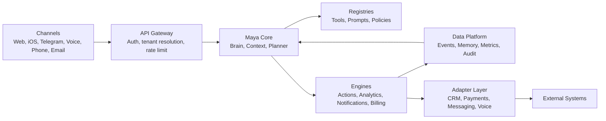
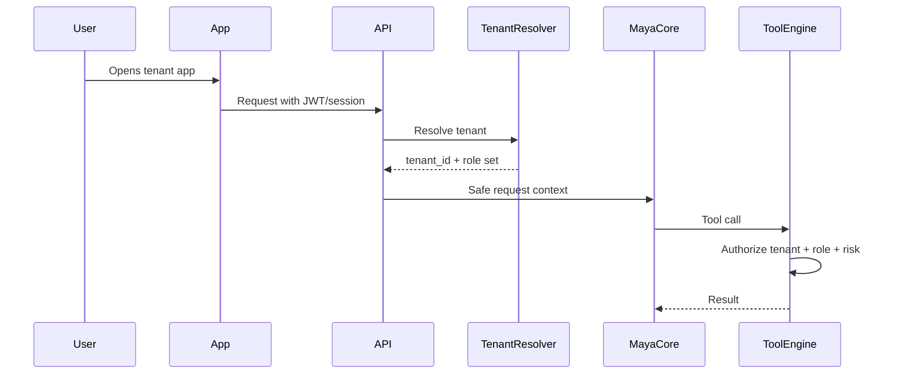
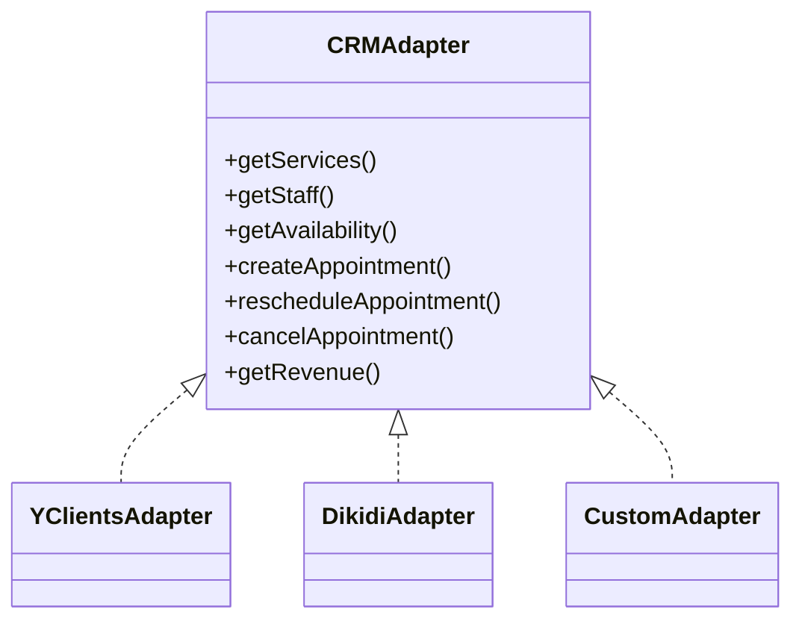

# Architecture

## Цель

Описать целевую архитектуру Maya OS: компоненты ядра, границы модулей,
multi-tenant модель, данные, security, integrations и путь от текущего проекта к
универсальной платформе.

## Описание

Maya OS строится как modular monolith first с ясными доменными границами и
готовностью к выделению сервисов после появления нагрузки. Главный риск сейчас
не в недостатке микросервисов, а в смешении AI, permissions, business logic,
frontend state и CRM-specific кода.

## Maya Core Components

| Компонент | Назначение | Статус сегодня |
|---|---|---|
| Maya Brain | центральный reasoning/tool-loop | есть в production contour, требует выделения core |
| Context Builder | собирает безопасный контекст под роль и канал | есть частично |
| Memory Engine | user/team/business memory без ПД в LLM | есть частично |
| Knowledge Engine | RAG/документы/регламенты tenant | начато, нужно универсализировать |
| Planner Engine | строит план действий и выбирает tools/agents | пока внутри prompt/tool-loop |
| Tool Engine | исполняет backend tools | первый tenant-scoped platform slice готов |
| Tool Registry | описывает tools, schemas, permissions, risk tier | типизированный code registry готов для первого slice |
| Action Engine | запускает подтвержденные действия | approval/idempotency runtime готов, UI pending |
| Analytics Engine | KPI, BI, прогноз, причинность | есть basic analytics, нужен data mart |
| Notification Engine | push/Telegram/SMS/email/WhatsApp | есть частично |
| Billing Engine | тарифы, limits, usage, subscriptions | есть в SaaS backend |
| Marketplace Engine | plugins, adapters, skills | не реализовано |
| CRM Adapter Layer | YClients/Altegio/Dikidi/custom adapters | есть в SaaS backend |
| Security Layer | auth, audit, encryption, consent | есть частично, требует P0 |
| Permission Layer | RBAC/ABAC/tool authorization | есть частично |
| Event Bus | domain events and async jobs | нужен |
| Prompt Registry | versioned prompts by role/channel/tenant | нужен |

Дополнительно нужны:

- Tenant Registry: tenant, domain, plan, feature flags, white-label config.
- Identity Graph: user can have many roles and external identities.
- Consent Registry: marketing, PII, biometric, voice recording, cross-border flags.
- Data Platform: normalized events, metrics_daily, segment snapshots, forecasts.
- Observability Layer: tool audit, cost audit, latency, errors, AI evals.

## Целевая Схема

## Multi-Tenant Architecture

Tenant isolation is mandatory. Every business object must be scoped by
`tenant_id`, except globally unique auth/session tokens where tenant resolution
is part of the lookup.

Tenant resolution order:

1. authenticated session/JWT tenant;
2. explicit tenant slug in trusted onboarding/admin flows;
3. host/domain mapping for public config only;
4. Telegram deep-link binding for shared bot;
5. never from LLM arguments.

## Универсальная Domain Model

Core entities:

- Tenant: company/business account.
- Location: branch, room, venue, mobile service area.
- Resource: staff member, chair, room, car lift, equipment, virtual capacity.
- Service: bookable unit of work.
- ServiceCategory: taxonomy independent of industry.
- Customer: customer identity within tenant.
- Appointment: scheduled service occurrence.
- Order: commercial transaction.
- Payment: money movement.
- Package: subscription, certificate, bundle, course, membership.
- Entitlement: remaining visits/credits/benefits.
- LoyaltyAccount: points/cashback/referrals.
- Campaign: marketing or service communication.
- Task: operational task for staff/admin/owner.
- Conversation: dialog state and channel history.
- MemoryItem: safe preference/procedure/business rule.
- ToolInvocation: audit entry for AI/backend action.
- ApprovalRequest: pending human decision.
- Event: immutable domain fact.

## Integration Pattern

Every external system is hidden behind an adapter:

## Сценарии Использования

### Новый tenant

1. Tenant создается через onboarding или admin API.
2. Tenant получает план, branding, домен/slug и feature gates.
3. Owner подключает CRM credentials.
4. CRM adapter синхронизирует services, staff, locations.
5. Booking mode остается `preview`, пока live-readiness checks не пройдены.
6. После подтверждения owner включает live writes.

### Owner asking for business state

1. Owner пишет или говорит: "что сегодня по бизнесу".
2. API resolves tenant and owner role.
3. Context Builder дает Brain безопасный контекст.
4. Brain вызывает Analytics tools.
5. Analytics Engine берет materialized facts, не live CRM.
6. Maya объясняет цифры и предлагает action card.

### Client booking

1. Client выбирает услугу через диалог.
2. Tool Engine получает availability через CRM adapter.
3. Backend валидирует слот и client ownership.
4. Appointment создается через adapter only after confirmation.
5. Event Bus пишет appointment_created.
6. Notification Engine отправляет подтверждение.

## Requirements

- `tenant_id` on all tenant-owned rows.
- Server-side authorization for every tool and API endpoint.
- Tool invocation audit with request, actor, role, tenant, risk tier, status.
- Idempotency for money, booking, campaigns and destructive actions.
- Feature flags and plan gates evaluated on backend.
- No business logic in frontend bundles.

## Constraints

- Current production is a monolith; migration must be phased.
- YClients remains source of truth for current salon until cutover.
- Local SQLite copy may be empty and must not be trusted as production truth.
- Secrets must not be added to docs or chat.

## Risks

- Continuing to grow the Python monolith as platform core will slow Maya OS.
- Live CRM APIs are slow and inconsistent; analytics needs materialized facts.
- Multi-role users can break context if identity graph is not explicit.
- Global config tokens block real multi-tenant adapters.

## Recommendations

1. Treat current Python production as "vertical adapter + legacy production".
2. Treat NestJS/Postgres backend as the platform candidate.
3. Build Event Bus and Data Platform before deep BI/forecasting.
4. Do not onboard external tenants until secrets, tenant isolation and billing gates
   are verified.

## Operational Runbooks

- [Tenant authentication isolation](tenant-auth-isolation-runbook.md)
- [Session security](session-security-runbook.md)
- [Authentication abuse protection](auth-abuse-protection-runbook.md)
- [Authentication retention maintenance](auth-retention-maintenance-runbook.md)
- [Production bootstrap hardening](production-bootstrap-hardening-runbook.md)
- [AI tool runtime and approvals](ai-tool-runtime-runbook.md)
- [Isolated staging readiness](staging-readiness-runbook.md)
