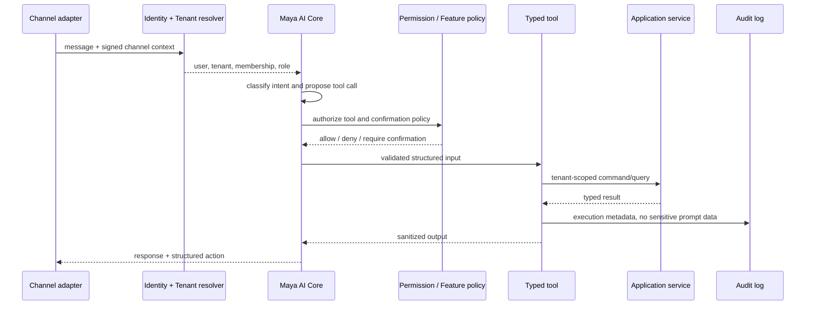

# Maya AI Core

## One core, multiple modes

Maya OS, Maya Admin and Maya Consult are capability profiles over one orchestration core. Native, web, voice and Telegram are channel adapters, not separate brains.

## Execution flow

## Tool definition

Each tool declares name, input/output schema, permissions, features, allowed roles, confirmation requirement, idempotency behavior, audit policy and rate limit. Tool execution receives `MayaExecutionContext`; it never accepts tenant ID from model output.

The channel-agnostic entry point is `POST /api/ai/chat`. It accepts a bounded
conversation, an opaque client request ID and one of `native`, `web`,
`telegram` or `voice`. The server resolves identity, tenant, role, entitlements
and tools before any model request. Provider keys never reach a channel.

## Capability profiles

- Maya OS: business analytics and owner actions; requires owner/manager permissions.
- Maya Admin: availability and booking operations; destructive changes require confirmation.
- Maya Consult: public catalog and the current customer's booking context; never receives internal finance or employee analytics.

## Safety rules

- No arbitrary SQL, shell or generic HTTP tools.
- PII collection and lookup remain deterministic backend steps; model prompts use redacted identifiers.
- A tool is denied if membership, permission or entitlement is missing.
- Financial/destructive actions use idempotency keys and auditable confirmation tokens.
- Tool outputs are minimized to the requesting role and channel.
- Provider failures cannot bypass policy through a fallback model.
- Phone numbers, email addresses, links, credential-like strings and names in
  common customer/staff phrases are redacted before provider calls.
- Conversation text and tool results are never written to audit logs; only
  provider/model identifiers, aggregate token counts and technical outcomes are
  recorded.
- AI chat has per-user and per-tenant cost/rate budgets. The model gets at most
  three bounded tool steps and cannot repeat the same tool payload.

## Migration path

1. Completed: inventory existing Python/Telegram tools.
2. Completed: wrap the first read-only platform tools behind typed contracts.
3. Completed: add shared role, entitlement and TenantContext policy.
4. Completed: add approval-gated cancellation and internal loyalty adjustment
   with immutable hashes and idempotency.
5. Completed: add the shared privacy-safe DeepSeek/OpenAI orchestration endpoint
   with deterministic no-key fallback, rate limits and aggregate usage audit.
6. Pending frontend/channel work: route native, web, Telegram and voice through
   `/api/ai/chat` and render approval cards.
7. Pending cutover work: retire duplicated prompt-side business logic only after
   parity and canary tests.

Maya Brain v1 now adds an optional routing, safe-memory, tenant-knowledge,
versioned-prompt and structured-plan layer over this core. It is disabled by
default and can be canaried on `native` while the legacy web/PWA model contract
remains unchanged. See [Maya Brain v1](maya-brain-v1.md).

Operational details and exact endpoints are in
[AI Tool Runtime Runbook](ai-tool-runtime-runbook.md).
