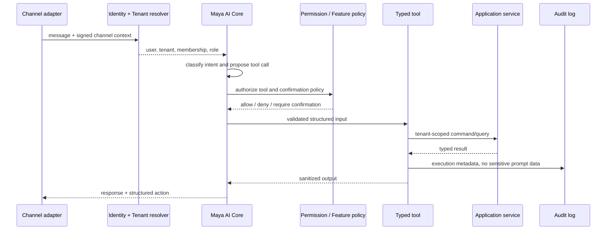

# Maya AI Core

## One core, multiple modes

Maya OS, Maya Admin and Maya Consult are capability profiles over one orchestration core. Native, web, voice and Telegram are channel adapters, not separate brains.

## Execution flow

## Tool definition

Each tool declares name, input/output schema, permissions, features, allowed roles, confirmation requirement, idempotency behavior, audit policy and rate limit. Tool execution receives `MayaExecutionContext`; it never accepts tenant ID from model output.

## Capability profiles

- Maya OS: business analytics and owner actions; requires owner/manager permissions.
- Maya Admin: availability and booking operations; destructive changes require confirmation.
- Maya Consult: public catalog and the current customer's booking context; never receives internal finance or employee analytics.

## Safety rules

- No arbitrary SQL, shell or generic HTTP tools.
- PII collection and lookup remain deterministic backend steps; model prompts use redacted identifiers.
- A tool is denied if membership, permission or entitlement is missing.
- Financial/destructive actions use idempotency keys and auditable confirmation tokens.
- Tool outputs are minimized to the requesting role and channel.
- Provider failures cannot bypass policy through a fallback model.

## Migration path

1. Completed: inventory existing Python/Telegram tools.
2. Completed: wrap the first read-only platform tools behind typed contracts.
3. Completed: add shared role, entitlement and TenantContext policy.
4. Completed: add approval-gated cancellation and internal loyalty adjustment
   with immutable hashes and idempotency.
5. Pending frontend/channel work: route native, web, Telegram and voice through
   the shared tool API and render approval cards.
6. Pending cutover work: retire duplicated prompt-side business logic only after
   parity and canary tests.

Operational details and exact endpoints are in
[AI Tool Runtime Runbook](ai-tool-runtime-runbook.md).
