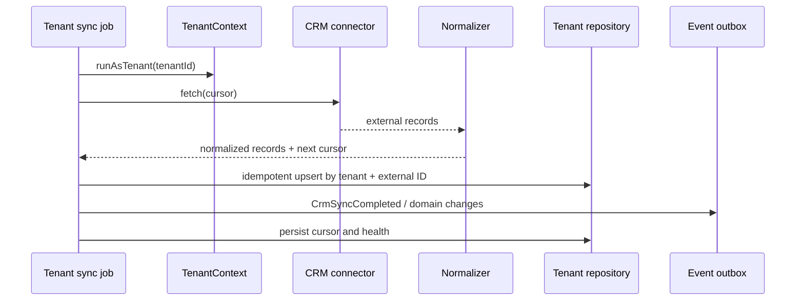

# CRM Integration Architecture

## Goal

CRM providers are infrastructure adapters. UI, booking policy and analytics consume Maya normalized models and must not branch on YClients-specific payloads.

## Contract

The existing `CRMAdapter` is preserved and expanded incrementally toward customer, employee, service, availability and booking synchronization. Each call receives trusted tenant context; credentials are loaded by tenant inside infrastructure.

`GET /api/crm/providers` is the public implementation-readiness contract. It
lists every known provider, but only entries with `connectable=true` may be
selected or persisted. This prevents an enum value or adapter scaffold from
being mistaken for a working integration.

Current implementation state:

| Provider | State | Connectable | Production use |
|---|---|---:|---|
| YClients | ready | yes | real connection after tenant acceptance |
| Altegio | ready | yes | compatible adapter, requires tenant acceptance |
| MAYA mock | development_only | local only | local/test/trial preview only |
| DIKIDI | planned | no | adapter scaffold only |
| Whitelines | planned | no | adapter scaffold only |
| Salon Online | planned | no | adapter scaffold only |

## Source of truth

Each tenant configures ownership separately:

| Data | Allowed ownership |
|---|---|
| customers | maya, external_crm, hybrid |
| services | maya, external_crm |
| employees | maya, external_crm |
| availability | maya, external_crm, hybrid |
| bookings | maya, external_crm, hybrid |
| payments | maya, external_crm, payment_provider |

Hybrid requires a documented conflict rule. Timestamp-only last-write-wins is not sufficient for bookings or money.

## Tenant connection lifecycle

Owner-facing clients use tenant-scoped routes and never send a tenant ID in the
path. The authenticated membership resolves the tenant:

| Method | Route | Purpose |
|---|---|---|
| `GET` | `/api/integrations/crm` | Safe connection status without credentials |
| `POST` | `/api/integrations/crm/connect` | Verify candidate credentials, then store them encrypted as `pending_activation` |
| `GET` | `/api/integrations/crm/preview` | Refresh normalized service and staff preview |
| `POST` | `/api/integrations/crm/activate` | Recheck and atomically activate CRM plus external calendar source |
| `POST` | `/api/integrations/crm/recheck` | Refresh connection health |
| `DELETE` | `/api/integrations/crm` | Delete the tenant credential and disconnect |

The MVP YClients/Altegio payload contains `provider`, `apiToken` and
`settingsJson.companyId`. `activeMasterIds` and `currency` are optional. The
token exists only in request memory. It is not accepted through AI chat,
analytics, URLs or provider settings.

DeepSeek/OpenAI, Yandex ID, Telegram Login, SMS, email delivery, MAYA
subscription billing and the YClients partner token are platform-owned server
secrets. A tenant never enters them. Per-tenant merchant acquiring is a
separate future payment integration and is not implied by CRM activation.

`connect` performs provider calls before encryption or persistence. A failed
candidate returns a stable error code and leaves the previous connection
untouched. A successful candidate returns a safe preview and is still blocked
from booking until the owner calls `activate`.

Connection statuses:

| Status | Meaning | Booking use |
|---|---|---|
| `pending_activation` | Credentials verified, owner confirmation pending | blocked |
| `active` | Verified and activated | allowed by the remaining booking gates |
| `error` | Stored connection failed its latest check | blocked |
| `inactive` | Deliberately disabled legacy state | blocked |

The older platform-admin routes remain compatible, but now internally perform
verify-before-save and immediate activation. New tenant UI must use the
tenant-scoped routes above.

## Sync flow

## Security and reliability

- Credentials are encrypted at rest and never returned by API.
- Provider settings are allowlisted before persistence and again before API
  serialization so a token cannot be smuggled through `settingsJson`.
- Connector factory receives tenant-bound decrypted credentials for one call scope.
- Webhooks verify signatures where supported, map credentials to tenant server-side and use idempotency keys.
- Current connection health persists verification time, latest check, latest
  successful preview/sync and a sanitized error category. Sync cursors, retry
  counters and provider request IDs remain part of the later background-sync
  worker.
- Backoff distinguishes rate limit, transient network and permanent validation errors.
- External IDs are unique per `(tenant, provider, entity_type, external_id)`.
- Booking reschedule remains non-destructive; no delete-and-recreate fallback.
- Planned providers fail with `crm_provider_not_available` before credentials
  are encrypted, persisted or passed to an adapter.

## Adding a connector

1. Implement the normalized connector contract.
2. Add provider configuration validation and encrypted credential schema.
3. Add fixture-based adapter tests and contract tests.
4. Define ownership and conflict behavior.
5. Add webhook verification/idempotency if available.
6. Add it to the provider catalog as non-connectable and verify the public
   contract.
7. Register the adapter in the factory; no UI component imports it.
8. Mark it connectable only after all required operations and negative-path
   tests pass.

## Mock connector

Mock CRM is mandatory for deterministic demo and CI flows. It must be tenant-aware and return independent datasets so isolation tests cannot pass accidentally through shared fixtures.
