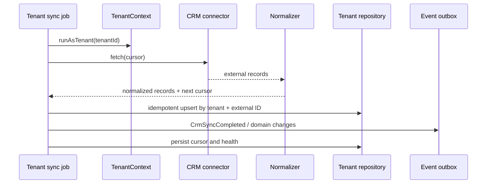

# CRM Integration Architecture

## Goal

CRM providers are infrastructure adapters. UI, booking policy and analytics consume Maya normalized models and must not branch on YClients-specific payloads.

## Contract

The existing `CRMAdapter` is preserved and expanded incrementally toward customer, employee, service, availability and booking synchronization. Each call receives trusted tenant context; credentials are loaded by tenant inside infrastructure.

## Source of truth

Each tenant configures ownership separately:

| Data | Allowed ownership |
|---|---|
| customers | maya, external_crm, hybrid |
| services | maya, external_crm |
| employees | maya, external_crm |
| availability | maya, external_crm, hybrid |
| bookings | maya, external_crm, hybrid |
| payments | maya, external_crm, payment_provider |

Hybrid requires a documented conflict rule. Timestamp-only last-write-wins is not sufficient for bookings or money.

## Sync flow

## Security and reliability

- Credentials are encrypted at rest and never returned by API.
- Connector factory receives tenant-bound decrypted credentials for one call scope.
- Webhooks verify signatures where supported, map credentials to tenant server-side and use idempotency keys.
- Sync cursors, retry count, last success, last error category and provider request ID are persisted.
- Backoff distinguishes rate limit, transient network and permanent validation errors.
- External IDs are unique per `(tenant, provider, entity_type, external_id)`.
- Booking reschedule remains non-destructive; no delete-and-recreate fallback.

## Adding a connector

1. Implement the normalized connector contract.
2. Add provider configuration validation and encrypted credential schema.
3. Add fixture-based adapter tests and contract tests.
4. Define ownership and conflict behavior.
5. Add webhook verification/idempotency if available.
6. Register the adapter in the factory; no UI component imports it.

## Mock connector

Mock CRM is mandatory for deterministic demo and CI flows. It must be tenant-aware and return independent datasets so isolation tests cannot pass accidentally through shared fixtures.
