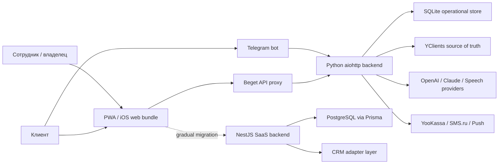

# Current State Audit

Дата аудита: 2026-07-11. Baseline: commit `0aa669da`, ветка `feature/multi-tenant-foundation`.

## Executive summary

Maya уже является работающей вертикальной платформой для «Мужской Эстетики», но её production-контур исторически построен как single-tenant система. Безопасный путь к SaaS — сохранить Python/PWA продукт и постепенно переносить bounded contexts в существующий NestJS/PostgreSQL strangler-backend. Создавать ещё один backend или копии интерфейса не требуется.

## System context

## Frontend

- Production PWA находится в `сайт и приложение/app.html`: это собранный React bundle без доступного исходного component tree.
- `сайт и приложение/app-tenant.html` является white-label зеркалом и уже получает public tenant config, однако содержит много отраслевых текстов и демонстрационных данных.
- `maya-admin.html`, `maya-start.html`, `maya-site.html` образуют self-serve цепочку платформы.
- Состояние авторизации, выбранного tenant и часть UI-состояния хранятся в `localStorage`; backend обязан считать эти значения только UX-подсказками.
- Текущая Aurora тема, Montserrat/Manrope и существующие токены должны стать default branding, а не отдельной темой-копией.

## Backends

### Production legacy

- `ai администратор/webhook_server.py`: крупный aiohttp REST/webhook монолит.
- `ai администратор/bot.py`: Telegram bot и фоновые задачи.
- `ai администратор/database.py`: SQLite DDL, миграции и ad-hoc repositories в одном модуле.
- `yclients.py` и YClients остаются источником истины для записей, расписания, услуг и части финансов.
- AI, лояльность, сертификаты, уведомления и аналитика тесно связаны с одним салоном и глобальными config constants.

### SaaS strangler

- `maya-saas-backend`: NestJS 11, TypeScript, Prisma 7, PostgreSQL.
- Модули auth, tenants, users, branches, branding, CRM, appointments, billing, audit log и onboarding уже разделены на Nest modules.
- CRM имеет adapter interface и mock/YClients implementations.
- API пока имеет prefix `/api`, DTO validation и JWT guards, но не единый `/api/v1` rollout.

### Historical blueprint

- `ai администратор/saas_blueprint` содержит полезные PostgreSQL/RLS эксперименты.
- Это reference implementation, не третий runtime. Новая production-логика добавляется в `maya-saas-backend` и подключается через strangler migration.

## Authentication and roles

- JWT хранит `user_id`, `tenant_id`, `role`.
- `User` одновременно является identity и tenant user; `tenantId`/`role` не позволяют одному человеку состоять в нескольких tenants.
- Roles являются крупными строковыми категориями (`platform_owner`, `tenant_admin`, `branch_manager`, `staff`, `client`). Granular permission engine отсутствует.
- `TenantAccessGuard` сравнивает route param с JWT tenant, но membership не проверяет и tenant context не создаёт.

## Data model and isolation

- PostgreSQL-модели `Branch`, `Appointment`, `CrmIntegration`, `AuditLog`, auth state и billing имеют `tenantId`.
- Prisma остаётся доступен напрямую любому service, поэтому tenant filter зависит от дисциплины автора запроса.
- `Appointment` фильтруется по tenant/client при чтении, но update выполняется затем только по `id`; это безопасно лишь пока предшествующий lookup не обходится.
- SQLite production schema почти полностью single-tenant. Таблица `maya_tenants` и blueprint не обеспечивают isolation действующего runtime.
- RLS ещё не применяется к Prisma schema.

## Booking and calendar

- Реальная запись идёт через CRM adapter; preview проверяет availability без создания записи.
- Локальная `Appointment` является read-through/audit projection внешней записи.
- Перенос выполняется non-destructive update в CRM, что является обязательным compatibility invariant.
- Внутренний calendar для Solo ещё не реализован как отдельный scheduling domain.

## Analytics, AI and Telegram

- Legacy analytics вычисляется в нескольких Python-модулях и endpoint handlers; определения метрик не централизованы.
- Owner AI, Maya Admin, client consultant, voice и Telegram используют общие данные, но пока не единый typed tool registry.
- Telegram identity и tenant resolution исторически привязаны к одному bot/config.
- ПД шифруются и редактируются перед LLM; это поведение нельзя ослаблять при миграции.

## Branding and features

- `BrandingSettings` хранит базовые цвета, logo, font и `themeJson`.
- `SubscriptionPlan.featuresJson` и статический feature catalog работают, но не образуют нормализованный entitlement engine.
- Backend feature guards применены не ко всем маршрутам.
- В UI всё ещё встречаются «салон», «мастер», «барбер» и конкретные данные Maya; industry terminology должна стать config-driven постепенно.

## Hardcoded and scaling constraints

- Legacy config содержит company ID, master IDs, домены, адреса и отраслевые правила.
- PWA является большим generated bundle, поэтому массовая переработка опасна и трудно ревьюится.
- Python job scheduler и SQLite connection model не рассчитаны на tenant-aware concurrency.
- Есть две эволюционные SaaS-линии (blueprint и NestJS); поддерживать обе как runtime нельзя.
- API versioning, correlation IDs, outbox и data retention workflow пока неполны.

## Preserve, adapt, replace

| Decision | Components |
|---|---|
| Preserve | PWA UX, YClients adapter semantics, non-destructive reschedule, encrypted PII, current public APIs, mock CRM, audit logging |
| Adapt | JWT/session context, User-to-tenant relation, plan flags, branding, Appointment repository, frontend config loading |
| Replace gradually | Direct Prisma access for tenant entities, SQLite ad-hoc repositories, role equality checks, scattered analytics formulas |
| Do not activate yet | Big-bang PostgreSQL cutover, broad RLS rollout without transaction context, replacement of working Python jobs |

## Safe migration entry points

1. Introduce Membership and backfill it without removing legacy `User.tenantId`.
2. Resolve tenant server-side into `TenantContext` and require active membership.
3. Put one existing aggregate (`Appointment`) behind a tenant-scoped repository.
4. Normalize plan entitlements while retaining `featuresJson` as compatibility output.
5. Expand branding fields and seed current Maya as the default tenant.
6. Route individual endpoints to NestJS only after contract and isolation tests pass.

## Baseline quality

- Jest: 19 suites, 71 tests passed.
- ESLint: passed.
- Nest build: passed.
- Full-root `tsc --noEmit`: pre-existing test-double typing errors; production build typecheck is clean. A dedicated production `typecheck` command is required in this slice.
- `npm audit`: 3 moderate and 2 high transitive findings; dependency remediation is outside this vertical slice and must be tracked separately.

## Dependencies that must not break

- Production VPS and SQLite are untouched by this slice.
- Beget PWA and iOS mirror are untouched.
- Existing JWT payload and public mobile config remain readable.
- Existing plan JSON and branding response keys remain available.
- YClients remains source of truth until each domain explicitly changes ownership.
