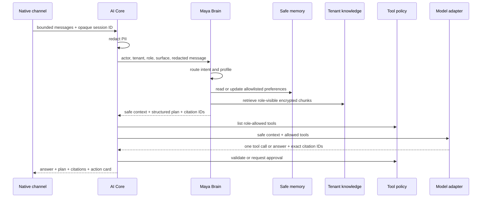

# Maya Brain v1

## Status

Maya Brain v1 is the first production-shaped orchestration slice over the
existing AI Core. It is additive, disabled by default, and can be enabled for
the native channel without changing the production PWA path.

This slice is not the complete universal analytics architecture from PR #21.
It establishes the safe routing, memory, knowledge, prompt and plan contracts
that later analytical vertical slices can reuse.

## Runtime flow



## Implemented contracts

### Router and profiles

The deterministic router classifies a bounded set of intents and selects one
logical profile over the shared core:

- Maya OS;
- Maya Admin;
- Maya Consult;
- Maya Finance;
- Maya Analytics;
- Maya Marketing;
- Maya HR;
- Maya Assistant.

Profiles do not grant permissions. The authenticated membership, role,
entitlements and typed tool registry remain the authorization boundary.

### Structured plan state

`AiBrainSession` stores only:

- a one-way hash of the client session key;
- tenant and authenticated actor relation;
- selected profile and intent;
- bounded step keys and statuses;
- technical request ID, counters and expiry.

Raw messages, model reasoning and chain-of-thought are not stored.

### Safe preference memory

`AiMemoryFact` accepts only explicit enum preferences:

- compact or detailed replies;
- emoji on or off;
- formal or informal address;
- Russian or English.

Values are encrypted at rest. Every fact has source, confidence, retention and
expiry. The current user can inspect and forget their preferences. Arbitrary
conversation text, names, phones, emails and free-form notes are rejected by
the contract.

### Tenant knowledge

Owners and authorized managers can add encrypted tenant knowledge sources.
Sources have role audiences and are split into bounded encrypted chunks.
Retrieval is tenant-scoped and role-filtered.

The model may cite only exact IDs supplied by retrieval. Invented citation IDs
fail closed. A procedural question without a matching source receives an
explicit no-source answer instead of a hallucination.

This first version uses deterministic lexical retrieval. Vector search,
document parsing and external knowledge connectors are intentionally deferred.

### Prompt registry

Profile prompts are selected from a code-versioned registry. The current
version is `maya-brain-v1.0.0`. Provider-specific model adapters consume the
same safe Brain context and typed tool contracts.

## API

- `POST /api/ai/chat` accepts optional `brainSessionId`.
- `GET /api/ai/brain/memory` lists the current user's safe preferences.
- `DELETE /api/ai/brain/memory` forgets the current user's memory.
- `GET /api/ai/brain/knowledge` lists tenant knowledge for managers.
- `POST /api/ai/brain/knowledge` creates an encrypted source.
- `DELETE /api/ai/brain/knowledge/:sourceId` archives a source.

## Canary and rollback

Configuration:

```dotenv
MAYA_BRAIN_V1_ENABLED="false"
MAYA_BRAIN_V1_SURFACES="native"
MAYA_BRAIN_V1_TENANT_IDS=""
AI_BRAIN_SESSION_TTL_HOURS="24"
AI_BRAIN_MEMORY_RETENTION_DAYS="180"
```

The safe rollout is:

1. deploy the additive migration and code with Brain disabled;
2. verify health, migrations and legacy AI Core traffic;
3. enable `MAYA_BRAIN_V1_ENABLED=true`, keep `native` as the only surface and
   add the internal tenant UUID to `MAYA_BRAIN_V1_TENANT_IDS`;
4. run native role, citation, memory and approval canaries;
5. disable the flag immediately if the canary regresses.

When Brain is disabled, the model receives the previous system prompt and
legacy response schema. No Brain session, memory or knowledge rows are written.
The production PWA source is not modified by this slice.

The tenant allowlist is mandatory and fails closed. An empty allowlist keeps
Brain on the legacy path even when the global flag is enabled, so a native
canary cannot silently expand to every tenant.

## Retention

`npm run ai:maintenance` removes expired Brain sessions and expired or
user-forgotten memory facts in bounded batches. Dry-run remains the default and
does not print payloads.

## Security invariants

- Tenant IDs come from authenticated server context, never model output.
- Session keys are hashed before persistence.
- Knowledge and memory values are encrypted at rest.
- Knowledge ingestion rejects obvious PII and credential patterns.
- Role filtering happens before knowledge reaches the model.
- PII redaction happens before Brain and provider calls.
- Tools, approvals, idempotency and audit remain deterministic backend
  boundaries.
- Audit stores technical metadata, profile, intent, citation count and memory
  keys, never conversation or knowledge content.

## Deliberately deferred

- CRM-independent canonical analytics and the period-comparison slice from PR
  #21;
- vector embeddings and rich file ingestion;
- customer, staff and business free-form memories;
- long-running autonomous plans and background agents;
- Telegram, voice and production PWA cutover;
- tenant-editable prompt versions and an eval promotion UI.

These are separate vertical slices and must keep the same feature-flag,
tenant-isolation and rollback discipline.
