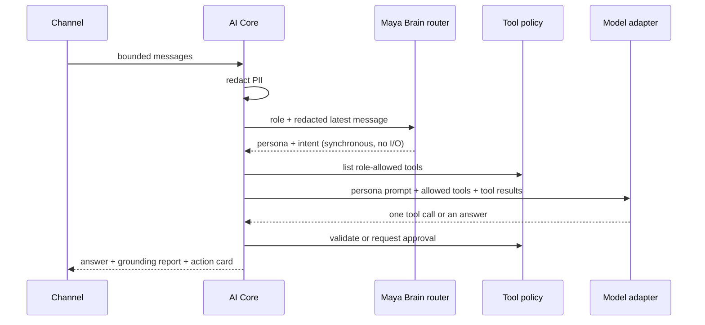

# Maya Brain

## Status

Maya Brain is **one router**. It picks the persona (`director` / `admin`) and
the intent for a turn, and that is all. It runs unconditionally: no feature
flag, no surface allowlist, no tenant allowlist, no database write.

Everything else that once lived here — eight prompt profiles, a prompt
registry, a step plan with statuses, a four-switch preference memory, an
encrypted knowledge base with citations, per-turn session rows, the
`/api/ai/brain/*` endpoints and a second provider switch — was removed on
2026-08-07 after a measurement pass.

## Why it shrank

| Removed | Measured reason |
|---|---|
| 8 prompt profiles + registry | One question routed through all eight profiles changed the model input by **2 lines out of 17 443 characters**. The persona split (216 lines) did all the real work. |
| Plan with step statuses | Written on every turn, read by nobody except the cleanup job. |
| Preference memory (4 switches) | Empty in production. |
| Knowledge base + citations | Empty in production, and analytical questions never routed into it. |
| `AiBrainSession` rows | Session identity already exists in the auth session; the row only carried the plan. |
| Activation gate (`MAYA_BRAIN_V1_ENABLED` / `_SURFACES` / `_TENANT_IDS`) | Off by default, so the owner received the **client** persona. |
| `MAYA_BRAIN_PROVIDER` | 🔴 A second provider switch that overrode `AI_CORE_PROVIDER` **only where the brain was active** — the native channel. An empty value there meant "no model" precisely where the brain was being switched on. |

## What remains



`MayaBrainRouterService.route(role, text)` returns exactly:

```ts
{ persona: 'director' | 'admin', intent: MayaBrainIntent }
```

- **persona** — clients and customers get `admin`, everyone else gets
  `director`. This selects one of two persona prompts in the model adapter.
- **intent** — one of `booking`, `schedule_management`, `business_analytics`,
  `finance`, `staff_operations`, `marketing`, `knowledge`, `catalog`,
  `loyalty`, `support`, `general`. AI Core uses it to decide whether a question
  must be grounded in verified analytics before the model may answer.

Both values are reported in the chat response under `brain` and in the audit
trail as `brain_persona` / `brain_intent`.

## Database

The tables `AiBrainSession`, `AiMemoryFact`, `AiKnowledgeSource` and
`AiKnowledgeChunk` still exist in the schema. Nothing reads or writes them any
more. Dropping them is a one-way door and is deliberately left as a separate
decision; `scripts/ai-runtime-maintenance.ts` continues to drain expired rows.

## Configuration

None. The router reads no environment variable. The only AI provider switch is
`AI_CORE_PROVIDER`.
