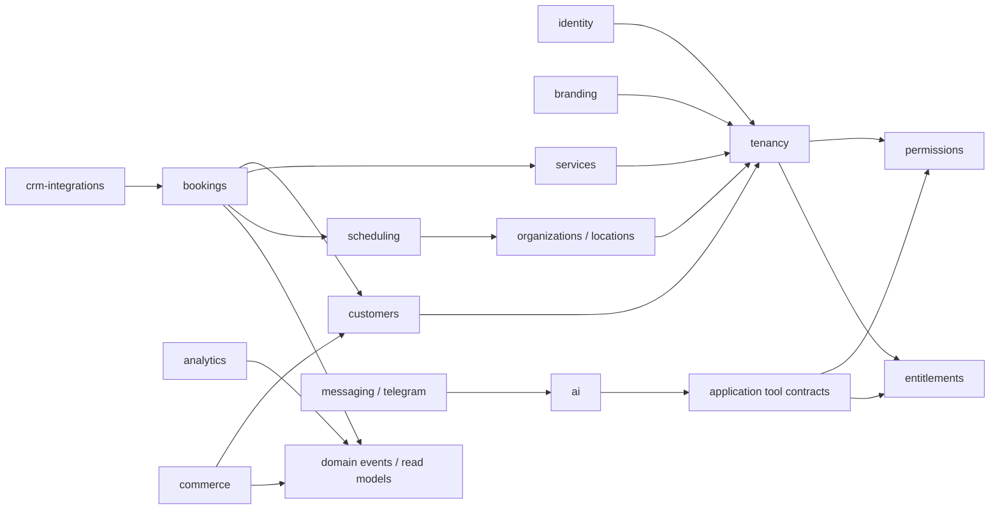

# Module Boundaries

## Dependency direction

Arrows point from consumer to required public contract. A module must not import another module's private repository.

## Foundation modules

| Module | Owns | Public contracts | Must not own |
|---|---|---|---|
| identity | User, credentials, sessions, social identities | authenticate, revoke, load identity | tenant role as a single global field |
| tenancy | Tenant, Membership, TenantContext, resolver | resolve context, assert membership | business entities |
| entitlements | Feature registry, plan entitlements, overrides | effective features, feature guard | UI-only hiding |
| branding | BrandingConfig and design-token projection | public branding config | copied tenant CSS bundles |
| audit-log | immutable security/business audit entries | record action | application logs with secrets |

## Business modules

| Module | Aggregate roots | Notes |
|---|---|---|
| organizations | Organization, Location, Department | Branch is a temporary compatibility name for Location |
| customers | Customer, customer identities, merge | User is not Customer; linked identities are explicit |
| workforce | EmployeeProfile, ProviderProfile | terminology comes from industry preset |
| catalog | Service, category, resource | CRM mapping stays in integrations |
| scheduling | availability, working hours, resources | no customer payment logic |
| bookings | Booking/Appointment lifecycle | source-agnostic, emits domain events |
| crm-integrations | credentials, sync cursor, external mappings | adapters normalize provider schemas |
| analytics | metric definitions and read models | no formulas in controllers/UI |
| finance | Expense, Transaction | accounting policy is tenant-configured |
| commerce | Order, Payment, Certificate, ledger | all redemption/financial writes idempotent |
| ai | tool registry, policies, execution audit | no arbitrary SQL or direct provider tables |
| messaging | notification delivery and channel adapters | does not duplicate business decisions |

## Enforcement approach

- Nest modules export application services and repository interfaces only.
- Prisma delegates remain infrastructure details.
- Cross-module writes use application commands; asynchronous reactions use domain events.
- Shared code is limited to technical primitives, IDs, errors and tenant context.
- Cycles are resolved by extracting a contract/event, not by importing both modules globally.

## Current compatibility map

- `branches` maps to future locations.
- `staff` maps to workforce/provider projections from CRM.
- `appointments` is the first tenant-scoped proof aggregate.
- `subscriptions` maps to SaaS billing plans, not customer membership subscriptions.
- Legacy Python remains behind anti-corruption adapters until each use case migrates.
