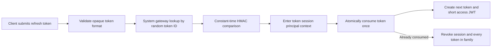

# Session Security Runbook

## Scope

This slice adds revocable server sessions and one-time refresh-token rotation to the NestJS/PostgreSQL platform backend. It does not change the website, PWA, iOS bundle, Python/SQLite runtime, live providers or production infrastructure.

## Token model

- Access JWTs retain the existing `access_token` response field, expire after 15 minutes by default and carry a signed `session_id`.
- Every protected request validates the server session before loading the user or Membership.
- Refresh tokens are opaque credentials with a random public token ID and 256-bit secret.
- PostgreSQL stores only an HMAC-SHA256 token hash. Raw refresh tokens are returned once and never logged or persisted.
- A session has an absolute 30-day lifetime by default. Rotation does not extend that deadline.
- Client IP is stored only as an HMAC. Device inventory retains a coarse label such as `Safari on iPhone`, not the raw user agent.

## Configuration

- Set `JWT_ACCESS_TTL_SECONDS` between `300` and `3600`; the default is `900`.
- Set `AUTH_REFRESH_TOKEN_TTL_DAYS` between `1` and `90`; the default is `30`.
- Generate independent high-entropy values for `AUTH_REFRESH_TOKEN_SECRET` and `AUTH_SESSION_METADATA_SECRET` before production rollout. The JWT secret is a compatibility fallback, not the recommended production configuration.
- Rotating `AUTH_REFRESH_TOKEN_SECRET` invalidates every outstanding refresh token. Coordinate that change with an explicit re-login window.
- Rotating `AUTH_SESSION_METADATA_SECRET` only changes future IP HMAC values and does not invalidate sessions.

## Rotation and replay



Concurrent use of the same refresh token produces one rotation and one replay result. Replay revokes the whole session, including the newly rotated token and access JWT. Clients must therefore serialize refresh work through one in-flight operation.

## API contract

Authentication success responses now add:

```json
{
  "access_token": "short-lived JWT",
  "refresh_token": "one-time opaque token",
  "token_type": "Bearer",
  "expires_in": 900,
  "refresh_expires_at": "ISO timestamp",
  "session": {
    "id": "session UUID",
    "device_name": "Safari on iPhone",
    "status": "active",
    "is_current": true
  }
}
```

Endpoints:

- `POST /api/auth/refresh` with `{ "refreshToken": "..." }` rotates both tokens.
- `POST /api/auth/logout` with Bearer access token revokes the current session.
- `GET /api/auth/sessions` lists up to 50 sessions owned by the current user.
- `DELETE /api/auth/sessions/:id` revokes one owned session.
- `DELETE /api/auth/sessions` revokes every session owned by the current user.

Stable refresh errors are `refresh_token_invalid`, `refresh_token_reused`, `session_expired` and `session_revoked`. A client must clear both credentials and require login for all four.

## Database migration

Migration `20260711230000_session_security` creates `AuthSession` and `AuthRefreshToken`, indexes active owner/session lookups and installs `AuthSession_user_tenant_guard`.

The trigger rejects a session when its `userId` and nullable `tenantId` do not match the owning `User`. It covers tenant users and platform users while preserving the platform owner's null tenant.

No existing row or column is removed. Existing access JWTs have no `session_id` and will be rejected after rollout, so deployment requires an explicit re-login window and coordinated frontend release.

## Verification

```bash
cd maya-saas-backend
npm run prisma:generate
npx prisma validate
npm run typecheck
npm run lint
npm test -- --runInBand
npm run test:e2e -- --runInBand
npm run build
```

Migration checks must include fresh and upgrade PostgreSQL databases, Prisma schema diff, trigger rejection of a cross-tenant session and idempotent seed. HTTP smoke must cover rotation, sequential replay, concurrent replay, immediate access revocation, session inventory, selective revoke, logout and revoke-all.

## Remaining work

- Distributed auth limits continue in `auth-abuse-protection-runbook.md`.
- Bounded session retention continues in [auth-retention-maintenance-runbook.md](auth-retention-maintenance-runbook.md); consumed token history remains until its inactive parent session ages out.
- Evaluate an HttpOnly same-site cookie transport when web deployment topology is final.
- Add security alert delivery for refresh-token reuse after notification infrastructure exists.

Production remains on the current runtime until a separately reviewed migration and cutover is approved.
