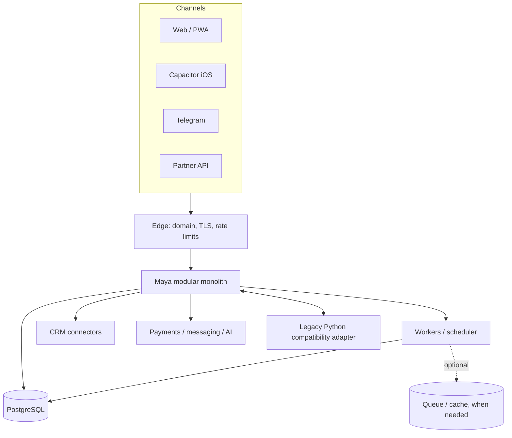

# Target Architecture

## Direction

Maya evolves as one modular monolith and one codebase. NestJS/PostgreSQL becomes the platform core by strangling selected legacy capabilities; Python remains an adapter/runtime during migration, not a competing product.

## Containers

## Architectural rules

- Global identity is `User`; tenant access is `Membership`.
- Every business aggregate contains `tenantId` and is accessed through a tenant-scoped repository.
- Tenant is derived from authenticated membership, verified host/subdomain, integration credentials or trusted channel binding; arbitrary client tenant IDs never grant access.
- Modules communicate through public application services or domain events, not another module's private tables.
- Features are registry entries; plans and tenant overrides produce effective entitlements.
- Branding and industry presets change configuration and terminology, not domain logic.
- External CRM data passes through normalized contracts; source-of-truth policy is explicit per tenant and data type.
- AI executes only typed tools after tenant, permission, feature and confirmation checks.

## Request lifecycle

1. Edge assigns a request ID and validates transport controls.
2. Authentication resolves global user or trusted integration identity.
3. Tenant resolver selects a candidate from signed session, verified domain or channel binding.
4. Membership guard confirms active access and role/permissions.
5. `TenantContext` is populated for the request.
6. Entitlement and permission guards authorize the use case.
7. Tenant-scoped repository adds tenant filters to reads and writes.
8. Audit log records sensitive actions without PII or secrets.

## Evolution constraints

- Keep the modular monolith until independent scaling or ownership proves a service boundary.
- Add `/api/v1` through aliases/compatibility routing rather than breaking `/api` clients.
- Add PostgreSQL RLS after all tenant-scoped calls run in explicit transaction context.
- Introduce an outbox before critical asynchronous finance, commerce or notification events move to workers.
