# Tenant Authentication Isolation Runbook

## Scope

This slice isolates password, phone, Yandex ID and Telegram authentication in the NestJS/PostgreSQL platform backend. It does not change the website, PWA, iOS app, Python/SQLite production runtime, live OAuth applications, SMS transport or deployment configuration.

## Public authentication boundary

A tenant slug in an authentication DTO is discovery input, not authorization. `TenantsService` first resolves the slug to a database tenant. Only that server-returned tenant ID may enter `TenantContextService.runAsPublicTenant`. If middleware already resolved a different trusted domain or subdomain, the request is rejected before auth persistence or provider exchange.

Password registration/login and phone start/verify execute user and challenge operations inside this public tenant context. Platform-owner login remains an explicit global path and never enters a tenant repository.

## Social callback boundary

```mermaid
flowchart LR
  Callback["OAuth callback with opaque state"] --> Gateway["System gateway: lookup state only"]
  Gateway --> Validate["Validate provider, expiry, tenant status and unused state"]
  Validate --> Conflict["Reject conflicting trusted domain tenant"]
  Conflict --> Context["Enter state tenant context"]
  Context --> Claim["Atomically claim state once"]
  Claim --> Provider["Exchange code with provider"]
  Provider --> Identity["Tenant-scoped identity lookup or create"]
  Identity --> Token["Issue tenant JWT"]
```



`AuthFlowSystemGateway` is the only cross-tenant auth-state read. It accepts only a high-entropy opaque state value and exposes no tenant selector or mutation. Every mutation after resolution uses `TenantAuthRepository` and the current context tenant.

The state is atomically claimed before the external provider exchange. A concurrent or replayed callback stops before provider I/O and identity writes. If provider exchange fails after the claim, the client must start a new OAuth flow; this is a deliberate fail-closed replay tradeoff.

## Phone challenge boundary

- Challenge upsert and lookup use `(tenantId, phone)`.
- Challenge updates use `(id, tenantId)`.
- Invalid attempts increment inside one database transaction and stop at the configured maximum even under concurrent requests.
- Successful verification atomically claims an unconsumed, unexpired row with the expected code hash.
- A concurrent verification or replay cannot create another user or issue another token.
- Existing client users cannot use phone login while their tenant is in trial; staff/admin trial access remains consistent with password and social login.
- The challenge is claimed before user creation. A downstream failure requires starting phone authentication again rather than reusing a code.

## Database constraints

Migration `20260711200000_auth_tenant_isolation`:

- adds tenant-qualified `(id, tenantId)` keys to `AuthIdentity`, `AuthFlowState` and `PhoneAuthCode`;
- adds `(id, tenantId)` to `User` as the target of a composite relation;
- replaces the identity-to-user foreign key with `AuthIdentity(userId, tenantId) -> User(id, tenantId)`;
- aborts if existing data contains a cross-tenant identity/user link.

No row or column is removed. Production rollout still requires a backup, sanitized-snapshot rehearsal and explicit approval.

## Verification

```bash
cd maya-saas-backend
npm run prisma:generate
npx prisma validate
npm run typecheck
npm run lint
npm test -- --runInBand
npm run build
```

Focused auth isolation suites:

```bash
npm test -- --runInBand \
  src/tenancy/tenant-context.service.spec.ts \
  src/auth/auth-flow-system.gateway.spec.ts \
  src/auth/tenant-auth.repository.spec.ts \
  src/auth/auth.service.spec.ts \
  src/auth/social-auth.service.spec.ts \
  src/users/users.service.spec.ts \
  src/onboarding/onboarding.service.spec.ts
```

Migration verification must cover a fresh database and an upgrade database containing valid auth rows. It must also prove that PostgreSQL rejects a new cross-tenant `AuthIdentity` relation.

## Remaining work

- Session rotation, revocation and device inventory continue in `session-security-runbook.md`.
- Add redirect URI allowlists per deployed OAuth client before enabling live providers.
- Add tenant/IP-aware distributed rate limiting for login, phone and OAuth start endpoints.
- Minimize and encrypt retained provider profile PII instead of keeping a raw OAuth profile payload.
- Add retention cleanup for consumed/expired phone and OAuth state rows.
- Move remaining tenant-management writes behind explicit platform repositories.
- Add transaction-local tenant context before enabling PostgreSQL RLS.

Production remains on the current runtime until a separately reviewed migration and cutover is approved.
