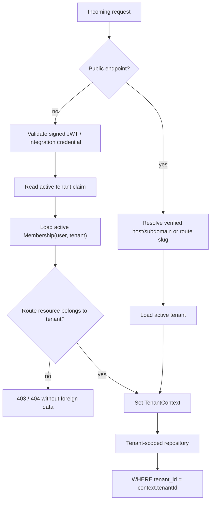

# Tenant Isolation

## Trust boundary

`tenantId` supplied by request JSON, query string or an arbitrary header is never authorization. A requested tenant may only narrow access already granted by a signed identity and active membership.

## Resolution flow

## TenantContext contract

The context contains `tenantId`, `membershipId`, `userId`, role, resolution source and request ID. It is stored with AsyncLocalStorage for the request lifetime. Platform-wide jobs and trusted bootstrap work must opt into an explicit system context per tenant; absence of context fails closed for tenant repositories.

System context may only receive a tenant ID selected by trusted backend code, such as the ID returned by tenant creation or a job partition loaded from the database. It must never turn a request body, query parameter or arbitrary header into authorization.

## Resolver precedence

1. Platform operation explicitly marked and audited.
2. Authenticated session plus active membership.
3. Signed integration API key bound to one tenant.
4. Verified Telegram/chat binding.
5. Public custom domain/subdomain/route slug for read-only configuration.

Conflicting trusted signals are rejected. `X-Tenant-Id` is not accepted as a selector.

## Repository rules

- `create`: tenant ID is injected from context, never copied from DTO.
- `find`: filter always includes context tenant.
- `update/delete`: predicate includes both entity ID and context tenant.
- Related IDs are checked in the same tenant before write.
- `findUnique({id})` is forbidden in tenant repositories unless the unique key includes tenant.
- Platform reports use dedicated cross-tenant services and roles, never disable filters globally.

## Membership transition

`User.tenantId` and `User.role` remain compatibility fields in Phase 1. Migration creates one active Membership for every tenant user. New writes create/update both representations transactionally. JWT validation trusts the database membership, not stale token claims.

## PostgreSQL RLS assessment

RLS is recommended as defence-in-depth after request and job transactions reliably execute `SET LOCAL app.tenant_id`. Application-layer checks remain mandatory. Enabling RLS before transaction context is universal risks outages or bypass through privileged connections.

## Required tests

- Tenant A cannot list tenant B appointments.
- Tenant A cannot cancel/reschedule a known tenant B appointment ID.
- A suspended membership cannot establish context.
- A JWT tenant claim without membership is rejected.
- A conflicting domain and signed membership is rejected where both are authoritative.
- Repository methods throw when TenantContext is absent.
- CRM credentials are not loaded when the requested tenant conflicts with context.
- Branch lists cannot select a foreign tenant and fail closed without context.
- Current-user reads and updates require both the current tenant and active Membership.
- A known foreign user ID cannot be read or mutated through tenant profile or booking paths.
