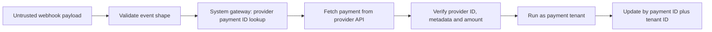

# Tenant Operations Isolation Runbook

## Scope

This slice protects branding writes, audit writes and billing operations in the NestJS/PostgreSQL strangler backend. It does not change the website, PWA, iOS app, Python/SQLite production runtime, VPS or live provider configuration.

## Migration

Migration `20260711170000_billing_tenant_isolation` adds the unique `(id, tenantId)` key to `BillingPayment`. The key is additive and lets every payment mutation carry the current tenant in its Prisma selector.

No existing column or record is removed. Production rollout still requires backup, sanitized-snapshot rehearsal, index build review and explicit approval.

## Enforced operations

- Branding upsert and logo upload assert the current tenant before database or filesystem writes.
- Audit persistence injects the tenant confirmed by `TenantContext` and fails closed without context.
- Tenant checkout, payment listing and recurring charge assert route tenant against context.
- Every payment update uses `(paymentId, tenantId)` rather than payment ID alone.
- Self-serve onboarding keeps branding, mock CRM, owner creation and audit writes inside one isolated system context bound to the server-created tenant.
- Platform tenant creation and status changes establish system context only for the audit record of the server-validated tenant.

## Webhook boundary



The webhook body is not accepted as payment truth. Its provider payment ID may only locate a local billing row through `BillingSystemGateway`; final state comes from the provider API. Provider ID, optional tenant/payment metadata and amount must match before any tenant mutation.

Environment-level webhook source controls, replay controls and production provider configuration remain separate deployment hardening tasks.

## Due billing boundary

`BillingSystemGateway` may list billable tenant candidates. `runDueBilling` then executes each candidate in a separate `runAsSystemTenant` callback. One failed tenant is recorded and cannot leak context into the next tenant.

## Verification

```bash
cd maya-saas-backend
npm run prisma:generate
npx prisma validate
npm run typecheck
npm run lint
npm test -- --runInBand
npm run build
```

Focused security suites:

```bash
npm test -- --runInBand \
  src/branding/branding.service.spec.ts \
  src/audit-log/audit-log.service.spec.ts \
  src/billing/billing-system.gateway.spec.ts \
  src/billing/billing.service.spec.ts \
  src/onboarding/onboarding.service.spec.ts
```

## Remaining isolation work

- Move tenant management mutations and auth state/identity writes behind explicit tenant or platform repositories.
- Add idempotent webhook event receipts and replay retention.
- Add transaction-local tenant context before enabling PostgreSQL RLS.
- Add production scheduler locking and observability before automatic recurring billing.

Production remains on the current runtime until a separately reviewed migration and cutover is approved.
