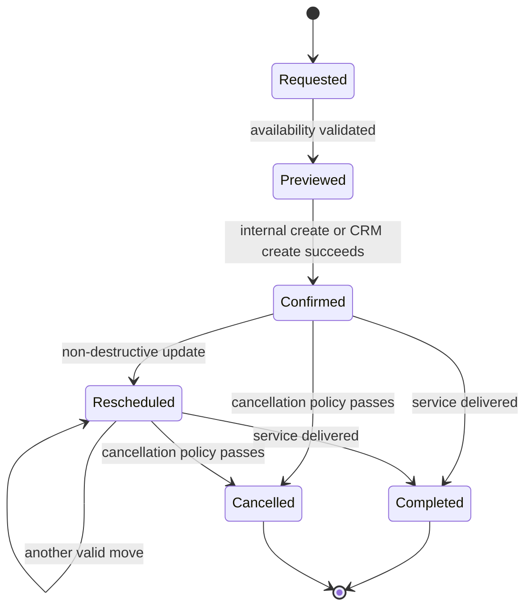

# Domain Model

## Identity and tenancy

- `User` is a global identity.
- `Membership` links a user to a tenant and carries tenant role/status.
- `Tenant` is the SaaS customer and billing/configuration boundary.
- `Organization` represents a business inside a tenant.
- `Location` and `Department` represent service delivery boundaries.

Phase 1 keeps legacy `User.tenantId` and `User.role` only as a compatibility projection.

## Core aggregates

| Aggregate | Tenant scoped | Key invariants |
|---|---|---|
| Tenant | platform scoped | unique slug/domain, valid plan/status |
| Membership | yes | unique user+tenant, active for request access |
| BrandingConfig | yes | one config per tenant, validated tokens |
| Customer | yes | encrypted PII, source identities, merge audit |
| ProviderProfile | yes | linked user optional, location/service eligibility |
| Service | yes | duration, currency and booking rules valid |
| Booking | yes | all related IDs share tenant, centralized status transition |
| Expense | yes | currency/amount/date and creator audit |
| Transaction | yes | immutable provider reference and idempotency |
| Certificate/Ledger | yes | balance derived from ledger entries |

## Booking flow



Booking source is one of internal calendar, customer app, CRM, Maya AI, Telegram, administrator, import or API. External provider payload is infrastructure metadata, not the domain model.

## Customer identity

Customer identity can have phone hash, email hash, CRM external IDs, Telegram binding and authenticated user link. Merge selects a surviving customer, re-points references transactionally and records immutable merge history. Raw PII is never used as a cross-tenant global key.

## Certificate redemption

```mermaid
sequenceDiagram
  participant Actor as Authorized employee/customer
  participant API as Commerce application service
  participant Policy as Permission + entitlement
  participant Ledger as Tenant ledger repository
  participant Outbox as Outbox

  Actor->>API: redeem(certificate, booking, idempotencyKey)
  API->>Policy: verify tenant, feature, permission
  API->>Ledger: lock certificate within tenant
  Ledger->>Ledger: verify available balance and prior key
  Ledger->>Ledger: append redemption debit entry
  Ledger->>Outbox: CertificateRedeemed
  Ledger-->>API: derived balance + receipt
  API-->>Actor: idempotent result
```

Reversal appends a compensating ledger entry; it never edits or deletes the original redemption.

## Domain events

Initial event vocabulary: TenantCreated, MembershipActivated, CustomerCreated, CustomerMerged, BookingCreated, BookingConfirmed, BookingRescheduled, BookingCancelled, BookingCompleted, PaymentCompleted, CertificatePurchased, CertificateRedeemed and CrmSyncCompleted.

Events carry IDs and non-sensitive facts. Critical asynchronous reactions use a transactional outbox before delivery.
