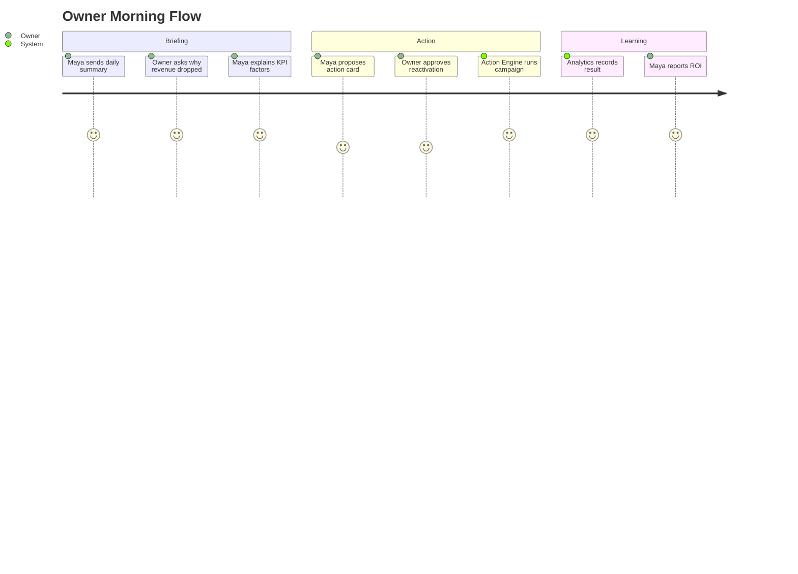

# Product

## Цель

Определить Maya OS как продукт: для кого она строится, какие роли поддерживает,
какие сценарии закрывает и чем отличается от CRM, чата и классического
приложения записи.

## Описание

Maya OS - AI Operating System для сервисного бизнеса. Главный интерфейс -
диалог с искусственным интеллектом. Экраны, таблицы и кнопки являются
поддерживающими поверхностями, но не центром продукта.

Maya должна стать цифровым сотрудником компании:

- владелец управляет бизнесом через разговор;
- сотрудники получают рабочий помощник и контекст клиента;
- клиенты записываются, консультируются и получают сервис через Maya;
- все данные и действия проходят через единое ядро permissions, tools и events.

## Продуктовые принципы

- AI First: диалог - главный интерфейс управления.
- Mobile First: каждое действие проектируется сначала для мобильного сценария.
- API First: бизнес-логика не живет во frontend.
- Multi-Tenant First: один продукт обслуживает много независимых компаний.
- White Label First: бренд, язык, домен, каналы и голос настраиваются tenant-wise.
- Security First: безопасность важнее удобства.
- Tool Calling First: AI вызывает только backend tools.
- Human Approval First: опасные действия требуют подтверждения.
- Explainability First: Maya объясняет рекомендации.
- Universal Architecture: сущности не завязаны на beauty.

## Роли

| Роль | Назначение | Доступные AI-возможности | Ограничения |
|---|---|---|---|
| CLIENT | клиент бизнеса | консультация, запись, перенос, история, бонусы, FAQ | видит только свои данные; write actions только для своих записей |
| SOLO_MASTER | владелец-исполнитель | календарь, клиенты, финансы, прогноз, AI-помощник | доступ только к своему tenant; финансовые действия через approval |
| STAFF | сотрудник/исполнитель | расписание, показатели, клиентский контекст, задачи, рекомендации | видит свои или разрешенные записи; ПД ограничены |
| ADMIN | администратор/оператор | управление календарем, ответы клиентам, загрузка, сертификаты, абонементы | не получает owner-only финансы и стратегические настройки |
| OWNER | владелец/директор | финансы, KPI, прогноз, маркетинг, сотрудники, branches, automation | dangerous actions только через approval и audit |

## Сценарии Использования

### CLIENT

- подобрать услугу и специалиста;
- записаться, перенести или отменить запись;
- увидеть историю посещений;
- купить сертификат или абонемент;
- использовать бонусы и реферальную программу;
- получить push/Telegram/WhatsApp/email уведомления;
- пройти AI-консультацию.

### SOLO_MASTER

- спросить "сколько я заработал за неделю";
- увидеть потерянных и постоянных клиентов;
- получить прогноз дохода;
- заполнить свободные окна;
- вести расходы и чистую прибыль;
- попросить Maya подготовить сообщение клиенту.

### STAFF

- посмотреть день, клиента, историю визитов и рекомендации;
- получить подсказку по допродаже;
- вести задачи и внутренний чат;
- видеть личные KPI и доход.

### ADMIN

- записать клиента от имени бизнеса;
- управлять переносами и отменами;
- отвечать клиентам;
- видеть загрузку специалистов;
- работать с сертификатами и абонементами.

### OWNER

- спросить "что происходит с бизнесом";
- получить причинный анализ выручки;
- увидеть риски и возможности;
- подтвердить действие: рассылку, возврат клиентов, изменение расписания;
- управлять tenant, тарифом, брендом, каналами и интеграциями.

## Архитектура Продуктового Опыта

## Связанные Контракты

- [Внутренний календарь Maya](internal-calendar.md) - единый booking API для
  индивидуальных специалистов без CRM и компаний с внешней CRM.
- [Управление графиком из native-чата](native-staff-schedule-chat.md) -
  безопасные команды закрытия дня, перерыва и сокращения смены через approval.
- [AI-онбординг](ai-onboarding.md) - разговорное создание бизнеса, безопасный
  черновик, готовые шаблоны и подтверждение структуры перед запуском.

## Требования

- Каждая роль имеет явную permission matrix.
- Роли могут пересекаться: один user может быть owner, staff и client.
- Все AI-ответы, затрагивающие бизнес-данные, должны опираться на tools.
- Продукт обязан поддерживать несколько vertical domains без новых таблиц под
  каждую отрасль.
- Любая коммуникация с клиентом требует consent state и audit.

## Ограничения

- Maya не должна подменять юридически значимые решения владельца.
- Maya не должна выполнять массовые рассылки без согласия и подтверждения.
- Maya не должна раскрывать ПД между ролями.
- UI не должен становиться CRM-панелью вместо AI-first опыта.

## Риски

- Попытка сделать "универсальную CRM" вместо AI OS размоет продукт.
- Слишком ранний marketplace без стабильного core создаст хаос интеграций.
- Beauty-specific сущности заблокируют выход в другие вертикали.
- Слабая объяснимость рекомендаций разрушит доверие владельца.

## Рекомендации

1. Оставить чат/голос главным интерфейсом, но добавить persistent owner feed для
   важных действий.
2. Все новые product stories писать в формате "role -> intent -> tool -> approval
   level -> event".
3. Не добавлять новую вертикаль, пока базовая domain model не покрывает ее без
   переименования таблиц.
